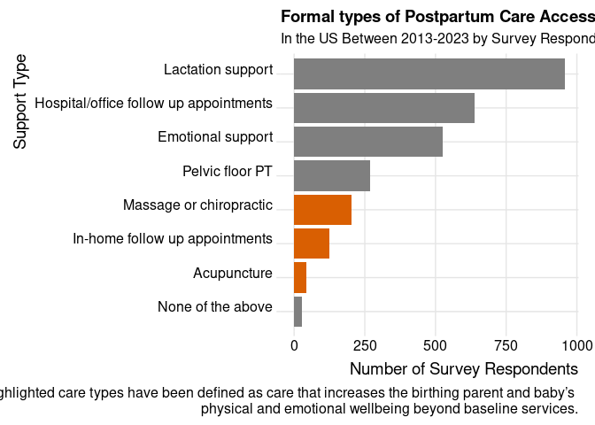
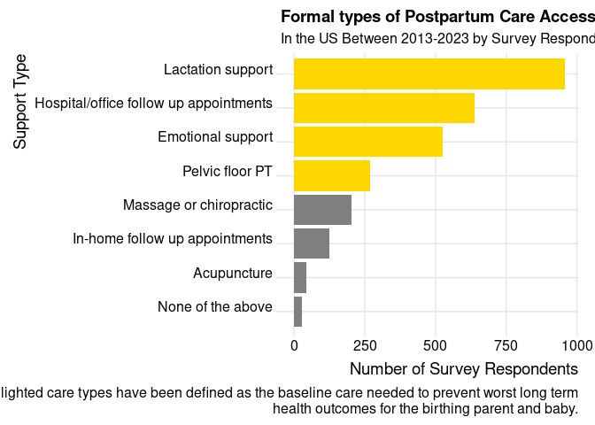
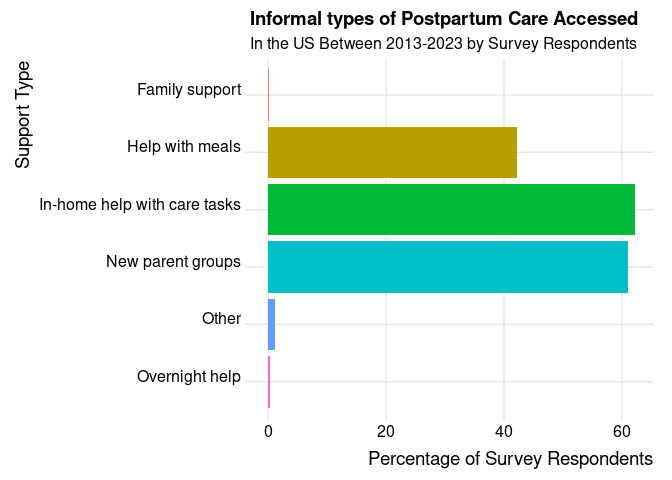
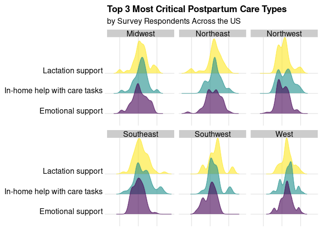
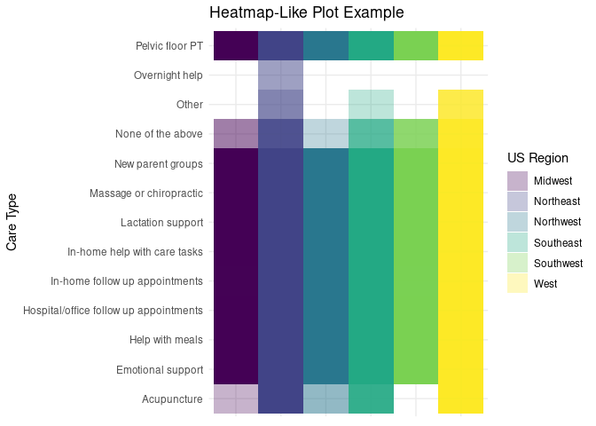
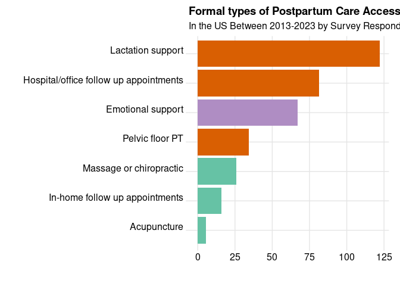
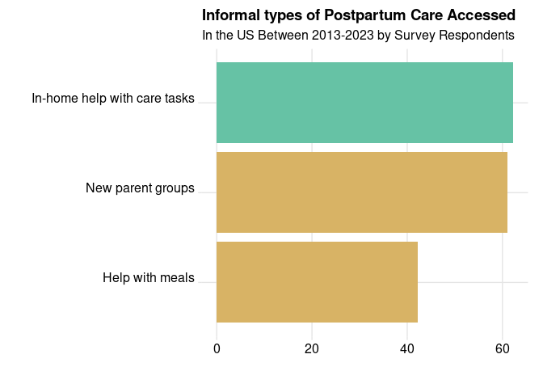

Project memo
================
Postparty Experience - Tikyra, Emmy, and Willow

This document should contain a detailed account of the data clean up for
your data and the design choices you are making for your plots. For
instance you will want to document choices you’ve made that were
intentional for your graphic, e.g. color you’ve chosen for the plot.
Think of this document as a code script someone can follow to reproduce
the data cleaning steps and graphics in your handout.

``` r
library(tidyverse)
library(broom)
library(readxl)
library(stringr)
library(forcats)
library(gridExtra)
library(dplyr)
library(openintro)
library(countrycode)
library(ggpattern)
library(ggplot2)
library(RColorBrewer)
library(ggridges)
library(visdat)
#library(corpustools)
```

``` r
Postpartum <- read.csv("Postpartum.csv")
```

## Data Clean Up Steps for Overall Data

### Step 1: Rename variables

``` r
# This step occurred in the proposal, but we wanted to ensure all clean up steps were included in the memo.

# Postpartum_Experience_renamed_variables <- as_tibble(Postpartum_Experience_Survey_Responses_raw_data) %>% 
 # rename( 
    #  `respondent` = `Timestamp`,
     # `state` = `Which US state or country did you give birth in?`,
     # `age` = `What was your age when you gave birth?`, 
     # `birth_location` = `Where did you give birth?`,
    #  `informed_by` = `When you were pregnant, did your care provider give you information about postpartum care services?`,
    #  `other_info_sources` = `Did you learn about postpartum care services from any other sources?`, 
    #  `support_type`= `What types of support did you have access to postpartum?`,
    #  `provider` = `Who provided this support for you?`,
    #  `ins_covered_services` = `What postpartum care services did your insurance cover?`,
    #  `cost_factor` = `Was cost a factor in how much support you received?`,
    # `if_insurance` = `If insurance covered postpartum care services, would you take advantage of it?`,
    # `critical_support` = `What support was most critical to you/your household in first year following birth?`,
    # `ideal_support` = `In a best case scenario, list all types of care and support you would need or want in the first year postpartum.`,
    # `comments` = `Is there anything else you want to share about your postpartum experience?`,
    # `emails` = `If you are open to follow up questions or want the results from this research project, please enter your email below.`)
```

### Step 2: Manual translation of ’critical_care\`

Each entry in `critical_care` was manually translated to match the
terminology used in the multiple choice answers listed in the
`support_type` variable. This resulted in a new “clean” version of
`critical_care` variable called `critical`. The purpose of this cleaning
step was to make the open ended answers easier to graph and compare to
other variables. Consistent language allows for clearer and more
meaningful visualizations.

``` r
# This step occurred in the proposal, but we wanted to ensure all clean up steps were included in the memo.

# Postpartum_combined <- bind_cols(Postpartum_Experience_renamed_variables, Clean_critical_care)

# head(Postpartum_combined)
```

### Step 3: Clean `age`

``` r
Postpartum <- Postpartum |> 
  mutate(first_age = substr(age, start = 1, stop = 2)) |> 
  mutate(first_age = if_else(first_age == "On", "35", first_age)) |> 
  mutate(first_age = as.numeric(first_age)) |> 
arrange(first_age) |> 

relocate(first_age, .after = age)
```

### Step 4: Clean `state`

``` r
Postpartum <- Postpartum |>
  mutate(state = str_replace(state, "CO", "Colorado")) |>
  mutate(state = str_replace(state, "IA", "Iowa")) |>
  mutate(state = str_replace(state, "DC", "Washington, D.C.")) |>
  mutate(state = str_replace(state, "TN", "Tennessee")) |>
  mutate(state = str_replace(state, "MS", "Mississippi")) |>
  mutate(state = str_replace(state, "Mass", "Massachusetts")) |>
  mutate(state = str_replace(state, "Massachusettsachusetts", "Massachusetts")) |>
  mutate(state = str_replace(state, "RI", "Rhode Island")) |>
  mutate(state = str_replace(state, "NY", "New York")) |>
  mutate(state = str_replace(state, "Tennesee", "Tennessee")) |>

  #In order to correct specific mistakes/misspellings etc across the data frame.
#using stringr package  

  filter(state != "United States",
         state != "United states",
         state != "US",
         state != "USA")
```

``` r
Postpartum <- Postpartum |> 
  mutate(first_state = sub("(,|and|1|/|-|\\(|&).*", "", state)) |>
arrange(first_state) |> 

relocate(first_state, .after = state)

Postpartum <- Postpartum |>
  mutate(first_state = str_replace(first_state, "Arizona ", "Arizona")) |>
  mutate(first_state = str_replace(first_state, "Arkansas ", "Arkansas")) |>
  mutate(first_state = str_replace(first_state, "California ", "California")) |>
  mutate(first_state = str_replace(first_state, "california ", "California")) |>
  mutate(first_state = str_replace(first_state, "california", "California")) |>
  mutate(first_state = str_replace(first_state, "Colorado ", "Colorado")) |>
  mutate(first_state = str_replace(first_state, "First", "Tennessee")) |>
  mutate(first_state = str_replace(first_state, "Tennessee ", "Tennessee")) |>
  mutate(first_state = str_replace(first_state, "Indiana ", "Indiana")) |>
  mutate(first_state = str_replace(first_state, "Kentcky", "Kentucky")) |>
  mutate(first_state = str_replace(first_state, "Massachusetts ", "Massachusetts")) |>
  mutate(first_state = str_replace(first_state, "Massachusettsechusetts", "Massachusetts")) |>
  mutate(first_state = str_replace(first_state, "Michigan ", "Michigan")) |>
  mutate(first_state = str_replace(first_state, "Minesotta", "Minnesota")) |>
  mutate(first_state = str_replace(first_state, "Minnesotta", "Minnesota")) |>
  mutate(first_state = str_replace(first_state, "New York ", "New York")) |>
  mutate(first_state = str_replace(first_state, "New york", "New York")) |>
  mutate(first_state = str_replace(first_state, "North carolina", "North Carolina")) |>
  mutate(first_state = str_replace(first_state, "Oregon ", "Oregon")) |>
  mutate(first_state = str_replace(first_state, "Rhode isl", "Rhode Island")) |>
  mutate(first_state = str_replace(first_state, "Rhode Isl", "Rhode Island")) |>
  mutate(first_state = str_replace(first_state, "Rhode Islandand", "Rhode Island")) |>
  mutate(first_state = str_replace(first_state, "Texas ", "Texas")) |>
  mutate(first_state = str_replace(first_state, "Washington ", "Washington")) |>
  mutate(first_state = str_replace(first_state, "New jersey", "New Jersey")) |>
  mutate(first_state = str_replace(first_state, "wisconsin", "Wisconsin")) |>
  mutate(first_state = str_replace(first_state, "virginia", "Virginia")) |>
  mutate(first_state = str_replace(first_state, "Virginia ", "Virginia")) |>
  mutate(first_state = str_replace(first_state, "Maryl", "Maryland")) |>
  mutate(first_state = str_replace(first_state, "North dakota", "North Dakota")) |>
  mutate(first_state = str_replace(first_state, "pennsylvania", "Pennsylvania")) 
  
 unique(Postpartum$first_state)
```

    ##  [1] "Alabama"              "Alaska"               "Arizona"             
    ##  [4] "Arkansas"             "California"           "Colorado"            
    ##  [7] "Connecticut"          "Delaware"             "District of Columbia"
    ## [10] "Tennessee"            "Florida"              "Georgia"             
    ## [13] "Hawaii"               "Illinois"             "Indiana"             
    ## [16] "Iowa"                 "Kansas"               "Kentucky"            
    ## [19] "Louisiana"            "Maine"                "Maryland"            
    ## [22] "Massachusetts"        "Michigan"             "Minnesota"           
    ## [25] "Mississippi"          "Missouri"             "Nebraska"            
    ## [28] "Nevada"               "New Hampshire"        "New Jersey"          
    ## [31] "New Mexico"           "New York"             "North Carolina"      
    ## [34] "North Dakota"         "Ohio"                 "Oklahoma"            
    ## [37] "Oregon"               "Pennsylvania"         "Rhode Island"        
    ## [40] "South Carolina"       "South Dakota"         "Texas"               
    ## [43] "Utah"                 "Vermont"              "Virginia"            
    ## [46] "Washington"           "West Virginia"        "Wisconsin"

### Step 5: Clean `support_type`

``` r
Postpartum <- Postpartum |>
  mutate(support_type = str_replace(support_type, pattern = "In-home help with tasks like laundry, cooking, cleaning, and child care", "In-home help with care tasks")) 
```

``` r
Postpartum <- Postpartum |>
  separate_longer_delim(support_type, delim = ",")
```

``` r
  unique(Postpartum$support_type)
```

    ##  [1] "Help with meals"                       
    ##  [2] "Lactation support"                     
    ##  [3] "In-home help with care tasks"          
    ##  [4] "Hospital/office follow up appointments"
    ##  [5] "Emotional support"                     
    ##  [6] "New parent groups"                     
    ##  [7] "Massage or chiropractic"               
    ##  [8] "Pelvic floor PT"                       
    ##  [9] "In-home follow up appointments"        
    ## [10] "Acupuncture"                           
    ## [11] "None of the above"                     
    ## [12] "Family support"                        
    ## [13] "Other"                                 
    ## [14] NA                                      
    ## [15] "Overnight help"

``` r
Postpartum <- Postpartum|>
  mutate(support_type = ifelse(support_type == " Mommy and me yoga and classes", "Other", support_type)) |>
  mutate(support_type = ifelse(support_type == " follow-up appointment with midwife; overnight doula (1 night per week)", "In-home wellness services and postpartum follow up appointments", support_type)) |>
  mutate(support_type = ifelse(support_type == " we didn’t have anyone else and I often wished we had someone to hold the both of us while we bonded with our baby.", "None of the above", support_type)) |>
  mutate(support_type = ifelse(support_type == " My partner was incredibly helpful. He handled all of the emotional support and meal and house prep and cleaning. However", "Other", support_type)) |>  
  mutate(support_type = ifelse(support_type == " any supports I had access to I had to find myself.", "NA", support_type)) |>
  mutate(support_type = ifelse(support_type == " As a note", "NA", support_type)) |>
  mutate(support_type = ifelse(support_type == "Yes there was a postpartum follow up but didnt seem like she did nuch other than repeat what she was reading off a pamphlet.", "Hospital or office based wellness services and postpartum follow up appointments", support_type)) |> 
  mutate(support_type = ifelse(support_type == " 1 PP appointment at 6 weeks", "Hospital or office based wellness services and postpartum follow up appointments", support_type)) |>
  mutate(support_type = ifelse(support_type == " Virtual postpartum follow up visits due to COVID", "Hospital or office based wellness services and postpartum follow up appointments", support_type)) |>
  mutate(support_type = ifelse(support_type == " In—home baby education", "Other", support_type)) |>
  mutate(support_type = ifelse(support_type == " Therapy (for PPD with second kid)", "Emotional support", support_type)) |>
  mutate(support_type = ifelse(support_type == " Postpartum doula", "In-home wellness services and postpartum follow up appointments", support_type)) |>
  mutate(support_type = ifelse(support_type == " Home visiting (Maine Families and public health nursing)", "In-home wellness services and postpartum follow up appointments", support_type)) |>
  mutate(support_type = ifelse(support_type == " I didn't really receive support. I know my pediatrician has lactation services but I didn't need.", "Lactation support", support_type)) |>
  mutate(support_type = ifelse(support_type == " Besides my required postpartum checkup and family care", "Hospital or office based wellness services and postpartum follow up appointments", support_type)) |>
  mutate(support_type = ifelse(support_type == " Some of these were offered but not helpful. Saw a behaviorist bc my dad died right before birth but they just said I “seemed fine” and were no help", "Hospital or office based wellness services and postpartum follow up appointments", support_type)) |>
  mutate(support_type = ifelse(support_type == " Ovia Parenting App coaches", "Other", support_type)) |>
  mutate(support_type = ifelse(support_type == " Baby was in NICU so we also had access to a social worker and classes with fellow nicu parents on development/feeding/etc", "Hospital or office based wellness services and postpartum follow up appointments", support_type)) |>
  mutate(support_type = ifelse(support_type == " Lactation support pre-covid. Post covid nothing in hospital", "Lactation support", support_type)) |>
  mutate(support_type = ifelse(support_type == " Stay at home spouse", "Other", support_type)) |>
  mutate(support_type = ifelse(support_type == " Lactation support was virtual only due to pandemic", "Lactation support", support_type)) |>
  mutate(support_type = ifelse(support_type == " One postpartum appointment with my OBGYN", "Hospital or office based wellness services and postpartum follow up appointments", support_type)) |>
  mutate(support_type = ifelse(support_type == "Gave birth in 2020. Everything I thought I’d have access to was shut down", "None of the above", support_type)) |>
  mutate(support_type = ifelse(support_type == " Except for my second  was born March 2020. I had no follow up", "None of the above", support_type)) |>
  mutate(support_type = ifelse(support_type == " most of my concerns were ignored by my ob.", "None of the above", support_type)) |>
  mutate(support_type = ifelse(support_type == " the process wasn’t easy or clear. After my 6-week checkup", "Hospital or office based wellness services and postpartum follow up appointments", support_type)) |>
  mutate(support_type = ifelse(support_type == " Had to seek out lactation help on my own", "Lactation support", support_type)) |>
  mutate(support_type = ifelse(support_type == " Ped PT and dentist for tie release + torticollis (for LO but her care is critical to my well being + BF journey)", "Other", support_type)) |>
  mutate(support_type = ifelse(support_type == "", "NA", support_type)) |>
  mutate(support_type = ifelse(support_type == " I probably could have had access to some of the other things on this list but didn't look into it", "None of the above", support_type)) |>
  mutate(support_type = ifelse(support_type == " Doula support", "In-home wellness services and postpartum follow up appointments", support_type)) |>
  mutate(support_type = ifelse(support_type == " I had access to lactation/new parent group but didn’t have the knowledge to go to them", "Lactation support", support_type)) |>
  mutate(support_type = ifelse(support_type == " Therapy for Anxiety", "Emotional support", support_type)) |>
  mutate(support_type = ifelse(support_type == " 6 week follow up pp with doctor", "Hospital or office based wellness services and postpartum follow up appointments", support_type)) |>
  mutate(support_type = ifelse(support_type == " Lactation support was VERY hard to access", "Lactation support", support_type)) |>
  mutate(support_type = ifelse(support_type == " 1x nurse check-in over phone (through hospital)", "Hospital or office based wellness services and postpartum follow up appointments", support_type)) |>
  mutate(support_type = ifelse(support_type == " Nighttime support night nurse", "Overnight help", support_type)) |>
  mutate(support_type = ifelse(support_type == " Postpartum doula and a night doula", "In-home wellness services and postpartum follow up appointments", support_type)) |>
  mutate(support_type = ifelse(support_type == " Therapist but not specializing in postpartum concerns", "Emotional support", support_type)) |>
  mutate(support_type = ifelse(support_type == " Family", "Family support", support_type)) |>
  mutate(support_type = ifelse(support_type == " Mental health therapy", "Emotional support", support_type)) |>
  mutate(support_type = ifelse(support_type == " but the second hospital I delivered at has a robust new parent program", "New parent groups - in person", support_type)) |>
  mutate(support_type = ifelse(support_type == " I didn’t attend any of the new parent groups", "NA", support_type)) |>
  mutate(support_type = ifelse(support_type ==" I probably had access to pelvic floor therapy but didn’t know about it in order to access it.", "Pelvic floor rehabilitation", support_type)) |>
  mutate(support_type = ifelse(support_type ==" Doula. Also", "In-home wellness services and postpartum follow up appointments", support_type)) |>
  mutate(support_type = ifelse(support_type ==" Emotional support", "Emotional support", support_type)) |>
  mutate(support_type = ifelse(support_type ==" None of the above", "None of the above", support_type)) |>
  mutate(support_type = ifelse(support_type ==" Grief support", "Grief support", support_type)) |>
  mutate(support_type = ifelse(support_type ==" Pelvic floor rehabilitation", "Pelvic floor rehabilitation", support_type)) |>
  mutate(support_type = ifelse(support_type ==" New parent groups - online", " New parent groups - online", support_type)) |>
  mutate(support_type = ifelse(support_type ==" Acupuncture", "Acupuncture", support_type)) |>
  mutate(support_type = ifelse(support_type ==" Massage or chiropractic", "Massage or chiropractic", support_type)) |>
  mutate(support_type = ifelse(support_type ==" New parent groups - in person", "New parent groups - in person", support_type)) |>
  mutate(support_type = ifelse(support_type ==" New parent groups - online", "New parent groups - online", support_type)) |>
  mutate(support_type = ifelse(support_type ==" Community meal train or other meal service", "Community meal train or other meal service", support_type)) |>
  mutate(support_type = ifelse(support_type ==" Hospital or office based wellness services and postpartum follow up appointments", "Hospital or office based wellness services and postpartum follow up appointments", support_type)) |>
  mutate(support_type = ifelse(support_type == " In-home wellness services and postpartum follow up appointments", "In-home wellness services and postpartum follow up appointments", support_type)) |>
  mutate(support_type = ifelse(support_type == "Hospital or office based wellness services and postpartum follow up appointments", "Hospital/office follow up appointments", support_type)) |>
  mutate(support_type = ifelse(support_type == " In-home wellness services and postpartum follow up appointments", "In-home follow up appointments", support_type)) |>
  mutate(support_type = ifelse(support_type == " In-home help with care tasks", "In-home help with care tasks", support_type)) |>
  mutate(support_type = ifelse(support_type == "Pelvic floor rehabilitation", "Pelvic floor PT", support_type)) |>
  mutate(support_type = ifelse(support_type == "New parent groups - in person", "New parent groups", support_type)) |>
  mutate(support_type = ifelse(support_type == "New parent groups - online", "New parent groups", support_type)) |>
  mutate(support_type = ifelse(support_type == "In-home wellness services and postpartum follow up appointments", "In-home follow up appointments", support_type)) |>
  mutate(support_type = ifelse(support_type == "Community meal train or other meal service", "Help with meals", support_type)) |> 
  mutate(support_type = ifelse(support_type == "Grief support", "Emotional support", support_type))
```

``` r
unique(Postpartum$support_type)
```

    ##  [1] "Help with meals"                       
    ##  [2] "Lactation support"                     
    ##  [3] "In-home help with care tasks"          
    ##  [4] "Hospital/office follow up appointments"
    ##  [5] "Emotional support"                     
    ##  [6] "New parent groups"                     
    ##  [7] "Massage or chiropractic"               
    ##  [8] "Pelvic floor PT"                       
    ##  [9] "In-home follow up appointments"        
    ## [10] "Acupuncture"                           
    ## [11] "None of the above"                     
    ## [12] "Family support"                        
    ## [13] "Other"                                 
    ## [14] NA                                      
    ## [15] "Overnight help"

### Step 6: Clean `birth_location`

``` r
Postpartum <- Postpartum |>
  mutate(birth_location = ifelse(birth_location == "Hospital, Was supposed to go to birth center", "Hospital", birth_location)) |>  
  mutate(birth_location = ifelse(birth_location == "At home", "Non-Hospital", birth_location)) |>
  mutate(birth_location = ifelse(birth_location == "Birthing Center attached to hospital", "Non-Hospital", birth_location)) |> 
  mutate(birth_location = ifelse(birth_location == "Free standing birth center", "Non-Hospital", birth_location)) |> 
  mutate(birth_location = ifelse(birth_location == "At home, I’m our car in an empty church parking lot", "Non-Hospital", birth_location)) |> 
  mutate(birth_location = ifelse(birth_location == "Began at a free standing birth center, had to transfer to a midwife center at a hospital", "Hospital", birth_location)) |> 
  mutate(birth_location = ifelse(birth_location == "Birthing center attached to a hospital", "Non-Hospital", birth_location)) |> 
  mutate(birth_location = ifelse(birth_location == "Planned home birth, transferred to hospital", "Hospital", birth_location)) |> 
  mutate(birth_location = ifelse(birth_location == "Free standing birth center, At home", "Non-Hospital", birth_location)) |> 
  mutate(birth_location = ifelse(birth_location == "Hospital, Homebirth transfer to hospital csection", "Hospital", birth_location)) |> 
  mutate(birth_location = ifelse(birth_location == "Natural birthing center attached to hospital", "Non-Hospital", birth_location)) |> 
  mutate(birth_location = ifelse(birth_location == "Hospital based birth center (across a sky bridge)", "Non-Hospital", birth_location)) |>
  mutate(birth_location = ifelse(birth_location == "Hospital, Hospital x2", "Hospital", birth_location)) |>
  mutate(birth_location = ifelse(birth_location == "Hospital, began care at birth center all 3 times & transferred", "Hospital", birth_location)) |>
  mutate(birth_location = ifelse(birth_location == "Birthing center within a hospital", "Hospital", birth_location)) |> 
  mutate(birth_location = ifelse(birth_location == "Hospital, Free standing birth center", "NA", birth_location)) |> 
  mutate(birth_location = ifelse(birth_location == "Hospital, At home", "NA", birth_location)) |>
  mutate(birth_location = ifelse(birth_location ==  "Hospital, Birth center room in the hospital", "NA", birth_location)) |>
  mutate(birth_location = ifelse(birth_location ==  "Hospital, Car", "NA", birth_location))
```

## Plots

### Plot 1: Bar chart

``` r
Postpartum |>
  filter(!is.na(support_type)) |>
  filter(support_type != "New parent groups - in person",
         support_type != "NA",
         support_type != "Overnight help",
         support_type != "Family support",
         support_type != "New parent groups",
         support_type != "In-home help with care tasks",
         support_type != "Other",
         support_type != "Help with meals") |>
  ggplot(mapping = aes(x = fct_rev(fct_infreq(support_type)), fill = support_type)) +
  geom_bar() +
  scale_fill_manual(
    values = c(
      "In-home follow up appointments" = "#d95f02",
      "Massage or chiropractic" = "#d95f02",
      "Acupuncture" = "#d95f02",
      "default" = "#66c2a5")) +
  #scale_fill_manual(
   # values = c(
    #  "Lactation support" = "#66c2a5",
     # "Emotional support" = "#66c2a5",
      #"Pelvic floor PT" = "#66c2a5",
    #  "Hospital/office follow up appointments" = "#66c2a5"))
     #  "default" = "darkblue")) +
  theme_bw() +
  theme_ridges() +
  theme(legend.position = 'none') + 
  coord_flip() +
  labs(title = "Formal types of Postpartum Care Accessed", 
       subtitle = "In the US Between 2013-2023 by Survey Respondents", 
       x = "Support Type", 
       y = "Number of Survey Respondents",
       caption = "The highlighted care types have been defined as care that increases the birthing parent and baby’s 
       physical and emotional wellbeing beyond baseline services."
       ) 
```

<!-- -->

``` r
#we could add text on graph with geom_text() to indicate pink = higher quality services

#ggsave("example-postpartum-wide-2.png", width = 10, height = 4)
```

``` r
Postpartum |>
  filter(!is.na(support_type)) |>
  filter(support_type != "New parent groups - in person",
         support_type != "NA",
         support_type != "Overnight help",
         support_type != "Family support",
         support_type != "New parent groups",
         support_type != "In-home help with care tasks",
         support_type != "Other",
         support_type != "Help with meals") |>
  ggplot(mapping = aes(x = fct_rev(fct_infreq(support_type)), fill = support_type)) +
  geom_bar() +
  scale_fill_manual(
    values = c(
      "Lactation support" = "gold",
      "Emotional support" = "gold",
      "Pelvic floor PT" = "gold",
      "Hospital/office follow up appointments" = "gold",
      "default" = "darkblue"
    )
    ) +
  theme_bw() +
  theme_ridges() +
  theme(legend.position = 'none') + 
  coord_flip() +
  labs(title = "Formal types of Postpartum Care Accessed", 
       subtitle = "In the US Between 2013-2023 by Survey Respondents", 
       x = "Support Type", 
       y = "Number of Survey Respondents",
       caption = "The highlighted care types have been defined as the baseline care needed to prevent worst long term
       health outcomes for the birthing parent and baby."
       ) 
```

<!-- -->

``` r
#ggsave("example-postpartum-wide-3.png", width = 10, height = 4)
```

``` r
Postpartum |>
  drop_na(support_type) |>
  filter(support_type != "Lactation support",
         support_type != "Hospital/office follow up appointments",
         support_type != "Emotional support",
         support_type != "Pelvic floor PT",
         support_type != "Massage or chiropractic",
         support_type != "In-home follow up appointments",
         support_type != "Acupuncture",
         support_type != "None of the above") |>
  select(respondent, support_type) |>
  count(support_type) |>
  mutate(percentage = n / 784 *100) |>
ggplot(mapping = aes(x = fct_rev(fct_infreq(support_type)), y = percentage, fill = support_type)) +
  geom_col() +
  theme_bw() +
  theme_ridges() +
  theme(legend.position = 'none') + 
  coord_flip() +
  labs(title = "Informal types of Postpartum Care Accessed", 
       subtitle = "In the US Between 2013-2023 by Survey Respondents", 
       x = "Support Type", 
       y = "Percentage of Survey Respondents",
     #  caption = "The highlighted care types have been defined as care that increases the birthing parent and baby’s  physical and emotional wellbeing beyond baseline services."
       ) 
```

<!-- -->

``` r
# Knowing the number of total respondents (in the US) made it easier to calculate percentage based on this set number 
```

### Plot 2: Leaflet map

#### Data cleanup steps specific to plot 2

``` r
# try mutating the group of care types into baseline/good, better, best with | between each care type

Postpartum <- Postpartum |>
  mutate(quality_critical = case_when(
    critical %in% c("Lactation support", "Pelvic floor PT", "Emotional support", 
                    "Hospital/office follow up appointments", "Unpaid parental leave") ~                      "baseline support",
    critical %in% c("In-home follow up appointments", 
                    "In-home help with care tasks", "Massage or chiropractic", 
                    "Acupuncture", "Overnight help") ~ "physical support",
    critical %in% c("Help with meals", "New parent groups", "Paid parental leave", 
                    "Family support") ~ "community support",
    TRUE ~ NA_character_
  ))

unique(Postpartum$quality_critical)
```

    ## [1] "community support" "physical support"  "baseline support" 
    ## [4] NA

``` r
Postpartum <- relocate(Postpartum, quality_critical, .after = critical)
```

``` r
Postpartum <- Postpartum |>
  mutate(quality_access = case_when(
    support_type %in% c("Lactation support", "Pelvic floor PT", "Emotional support", 
                    "Hospital/office follow up appointments", "Unpaid parental leave") ~                      "baseline support",
    support_type %in% c("In-home follow up appointments", 
                    "In-home help with care tasks", "Massage or chiropractic", 
                    "Acupuncture", "Overnight help") ~ "physical support",
    support_type %in% c("Help with meals", "New parent groups", "Paid parental leave", 
                    "Family support") ~ "community support",
    TRUE ~ NA_character_
  ))

unique(Postpartum$quality_access)
```

    ## [1] "community support" "baseline support"  "physical support" 
    ## [4] NA

``` r
Postpartum <- relocate(Postpartum, quality_access, .after = support_type)
```

``` r
Postpartum <- Postpartum |>
  mutate(regions = case_when(
    first_state %in% c("Connecticut", "Maine", "Massachusetts", "New Hampshire", 
                       "New Jersey", "New York", "Pennsylvania", "Rhode Island",
                       "Vermont", "Delaware") ~ "Northeast",
    first_state %in% c("Illinois", "Indiana", "Iowa", "Kansas", "Michigan", "Minnesota",
                       "Missouri", "Nebraska", "North Dakota", "Ohio", "South Dakota",
                       "Wisconsin") ~ "Midwest",
    first_state %in% c("Alabama", "Arkansas", "Florida", "Georgia", "Kentucky",
                       "Louisiana", "Maryland", "Mississippi", "North Carolina", 
                       "South Carolina", "Tennessee", "Virginia", "West Virginia", 
                       "Washington, D.C.") ~ "Southeast",
    first_state %in% c("Texas", "Oklahoma", "Arizona", "New Mexico") ~ "Southwest",
    first_state %in% c("Alaska", "California", "Colorado", "Hawaii", "Idaho", "Montana",
                       "Nevada", "Utah", "Wyoming") ~ "West",
    first_state %in% c("Oregon", "Washington", "Idaho") ~ "Northwest",
    TRUE ~ NA_character_
  ))

unique(Postpartum$regions)
```

    ## [1] "Southeast" "West"      "Southwest" "Northeast" NA          "Midwest"  
    ## [7] "Northwest"

``` r
Postpartum <- relocate(Postpartum, regions, .after = first_state)
```

``` r
#library(leaflet) ## For leaflet interactive maps
#library(sf) ## For spatial data
#library(RColorBrewer) ## For colour palettes
#library(htmltools) ## For html
#library(leafsync) ## For placing plots side by side
#library(kableExtra) ## Table  output (in slides)
#library(maps)
#library(mapdata)
#library(tigris)
#library(ggiraph) 
#install.packages('ggiraph')


# states <- states(cb = TRUE)


# leaflet(states) %>%
 # addProviderTiles(providers$OpenStreetMap) |>
  #addProviderTiles(providers$georegion) |>
 # addPolygons()
  

#lines above make base map
  
 # addProviderTiles(provider = providers$OpenStreetMap) |>
 # setView(lng = -80,
 #         lat = 34.5,
  #        zoom = 5) |>
 # addPolygons(
    


#Postpartum |>
#ggplot(state_stats) +
 # geom_sf(aes(fill = "regions")) +
  #labs(title = "map",
   #    x = "Longitude",
    #   y = "Latitude",
     #  fill = "regions")


#ADD thingie to show stats
#labels <- sprintf("<strong>%s</strong><br/>%g births", 
               #   nc$county, nc$births1974) %>% lapply(htmltools::HTML)
#head(labels, 1)
```

``` r
#map('state', fill = TRUE, col = palette())
```

### Plot 3 Clean up

## Cleaning `critical`

``` r
# Postpartum <- rename(Postpartum, "critical" = "critical_clean")
```

``` r
Postpartum <- relocate(Postpartum, critical, .after = critical_support)
```

``` r
Postpartum <- Postpartum |>
   separate_longer_delim(critical, delim = ",")
```

``` r
unique(Postpartum$critical)
```

    ##  [1] "Help with meals"                       
    ##  [2] "In-home help with care tasks"          
    ##  [3] "Lactation support"                     
    ##  [4] "Unpaid parental leave"                 
    ##  [5] "Pelvic floor PT"                       
    ##  [6] "Emotional support"                     
    ##  [7] "Family support"                        
    ##  [8] "New parent groups"                     
    ##  [9] "Hospital/office follow up appointments"
    ## [10] "Other"                                 
    ## [11] "Overnight help"                        
    ## [12] "In-home follow up appointments"        
    ## [13] "Paid parental leave"                   
    ## [14] "Massage or chiropractic"               
    ## [15] "Acupuncture"

``` r
Postpartum <- Postpartum |>
  mutate(critical = ifelse(critical == " In-home help with care tasks", "In-home help with care tasks", critical)) |>
  mutate(critical = ifelse(critical == " Lactation support", "Lactation support", critical)) |>
  mutate(critical = ifelse(critical ==  " Pelvic floor PT", "Pelvic floor PT", critical)) |>
  mutate(critical = ifelse(critical ==  " Emotional support", "Emotional support", critical)) |>
  mutate(critical = ifelse(critical ==  " Help with meals", "Help with meals", critical)) |>
  mutate(critical = ifelse(critical ==  " Family support", "Family support", critical)) |>
  mutate(critical = ifelse(critical ==  " Other", "Other", critical)) |>
  mutate(critical = ifelse(critical ==  " New parent groups", "New parent groups", critical)) |>
  mutate(critical = ifelse(critical ==  " In-home follow up appointments", "In-home follow up appointments", critical)) |>
  mutate(critical = ifelse(critical ==  " Paid parental leave", "Paid parental leave", critical)) |>
  mutate(critical = ifelse(critical ==  " Overnight help", "Overnight help", critical)) |>
  mutate(critical = ifelse(critical ==  " Massage or chiropractic", "Massage or chiropractic", critical)) |>
  mutate(critical = ifelse(critical ==  " Acupuncture", "Acupuncture", critical)) |>
  mutate(critical = ifelse(critical ==  " family support", "Family support", critical)) |>
  mutate(critical = ifelse(critical ==  " Hospital/office follow up appointments", "Hospital/office follow up appointments", critical)) |>
  mutate(critical = ifelse(critical ==  " New parent group", "New parent group", critical)) |>
  mutate(critical = ifelse(critical ==  "Pelvice floor PT", "Pelvic floor PT", critical)) |>
  mutate(critical = ifelse(critical ==  " Pelvic floor rehab", "Pelvic floor PT", critical)) |>
  mutate(critical = ifelse(critical ==  " Unpaid parental leave", "Unpaid parental leave", critical)) |>
  mutate(critical = ifelse(critical ==  " in-home help with care tasks", "In-home help with care tasks", critical)) |>
  mutate(critical = ifelse(critical ==  "Pelvic floor rehab", "Pelvic floor PT", critical)) |>
  mutate(critical = ifelse(critical ==  "Emotial support", "Emotional support", critical)) |>
  mutate(critical = ifelse(critical ==  "Help with meal", "Help with meals", critical)) |>
  mutate(critical = ifelse(critical ==  "Lactation", "Lactation support", critical)) |>
  mutate(critical = ifelse(critical ==  "Lactatiom support", "Lactation support", critical)) |>
  mutate(critical = ifelse(critical ==  "Emototional support", "Emotional support", critical)) |>
  mutate(critical = ifelse(critical ==  "In-home help with child care", "In-home help with care tasks", critical)) |>
  mutate(critical = ifelse(critical ==  "In-home help wih care tasks", "In-home help with care tasks", critical)) |>
  mutate(critical = ifelse(critical ==  "Help with care tasks", "In-home help with care tasks", critical)) |>
  mutate(critical = ifelse(critical ==  "New parent group", "New parent groups", critical)) |>
  mutate(critical = ifelse(critical ==  "Child care", "In-home help with care tasks", critical)) |>
  mutate(critical = ifelse(critical ==  "Lacation support", "Lactation support", critical)) |>
  mutate(critical = ifelse(critical ==  "Sleep support", "Overnight help", critical))
```

``` r
unique(Postpartum$critical)
```

    ##  [1] "Help with meals"                       
    ##  [2] "In-home help with care tasks"          
    ##  [3] "Lactation support"                     
    ##  [4] "Unpaid parental leave"                 
    ##  [5] "Pelvic floor PT"                       
    ##  [6] "Emotional support"                     
    ##  [7] "Family support"                        
    ##  [8] "New parent groups"                     
    ##  [9] "Hospital/office follow up appointments"
    ## [10] "Other"                                 
    ## [11] "Overnight help"                        
    ## [12] "In-home follow up appointments"        
    ## [13] "Paid parental leave"                   
    ## [14] "Massage or chiropractic"               
    ## [15] "Acupuncture"

### Plot 3: Ridge plot

``` r
Postpartum |>
  count(critical) |>
  arrange(desc(n))
```

    ##                                  critical   n
    ## 1            In-home help with care tasks 941
    ## 2                       Emotional support 788
    ## 3                       Lactation support 700
    ## 4                          Family support 400
    ## 5                         Help with meals 301
    ## 6                         Pelvic floor PT 220
    ## 7                       New parent groups 178
    ## 8          In-home follow up appointments 137
    ## 9                                   Other 136
    ## 10                         Overnight help  89
    ## 11                    Paid parental leave  78
    ## 12                Massage or chiropractic  70
    ## 13 Hospital/office follow up appointments  34
    ## 14                            Acupuncture  20
    ## 15                  Unpaid parental leave  10

``` r
Postpartum <- Postpartum |>
  filter(critical != "NA") |>
  filter(critical != "Duplicate entry") |>
  filter(!critical %in% c("Family support", "Help with meals",  "Pelvic floor PT", "New parent groups", "In-home follow up appointments", "Other", "Overnight help", "Paid parental leave", "Massage or chiropractic", "Hospital/office follow up appointments", "Acupuncture", "Unpaid parental leave")) |>
  filter(regions != "NA")

ggplot(Postpartum, 
       aes(x = first_age, 
           y = critical,
           color = critical, 
           fill = critical)) +
  facet_wrap(~ regions) +
  geom_density_ridges(alpha = .6) +
  scale_color_viridis_d(alpha = .6) +
  scale_fill_viridis_d(alpha = .6) +
 # scale_x_continuous(breaks = seq(from = 18, to = 44, by = 2)) +
  theme_ridges() +
  theme(legend.position = "none") +
  theme(axis.title.x = element_blank(),
       axis.text.x = element_blank(),
       axis.ticks.x = element_blank()) +
  theme(axis.title.y = element_blank()) +
  # need to re-order care types and potentially break it up by quality or formal/informal
  labs (title = "Top 3 Most Critical Postpartum Care Types", subtitle = "by Survey Respondents Across the US")
```

    ## Picking joint bandwidth of 1.03

    ## Picking joint bandwidth of 1.06

    ## Picking joint bandwidth of 1.23
    ## Picking joint bandwidth of 1.23

    ## Picking joint bandwidth of 1.16

    ## Picking joint bandwidth of 0.784

<!-- -->

``` r
ggsave("postpartum-ridges-wide.png", width = 10, height = 5)
```

    ## Picking joint bandwidth of 1.03

    ## Picking joint bandwidth of 1.06

    ## Picking joint bandwidth of 1.23
    ## Picking joint bandwidth of 1.23

    ## Picking joint bandwidth of 1.16

    ## Picking joint bandwidth of 0.784

``` r
Postpartum |>
  count(first_age) |>
  arrange(desc(n))
```

    ##    first_age   n
    ## 1         32 295
    ## 2         33 295
    ## 3         31 228
    ## 4         30 216
    ## 5         34 210
    ## 6         29 206
    ## 7         35 190
    ## 8         28 126
    ## 9         27  97
    ## 10        36  93
    ## 11        26  87
    ## 12        37  67
    ## 13        38  58
    ## 14        40  52
    ## 15        39  34
    ## 16        25  31
    ## 17        42  20
    ## 18        24  17
    ## 19        41  13
    ## 20        20  12
    ## 21        21  10
    ## 22        22   7
    ## 23        18   6
    ## 24        23   6
    ## 25        44   6

``` r
Postpartum <- Postpartum |>
  filter(critical != "NA") |>
  filter(critical != "Duplicate entry") |>
  filter(!critical %in% c("Family support", "Help with meals",  "Pelvic floor PT", "New parent groups", "In-home follow up appointments", "Other", "Overnight help", "Paid parental leave", "Massage or chiropractic", "Hospital/office follow up appointments", "Acupuncture", "Unpaid parental leave")) |>
  filter(regions != "NA")

ggplot(Postpartum, 
       aes(x = first_age, 
           y = critical,
           color = critical, 
           fill = critical)) +
 # facet_wrap(~ regions) +
  geom_violin() +
  #geom_density_ridges(alpha = .6) +
  scale_color_viridis_d() +
  scale_fill_viridis_d() +
 # scale_x_continuous(breaks = seq(from = 18, to = 44, by = 2)) +
  theme_ridges() +
  theme(legend.position = "none") +
  theme(axis.title.x = element_blank()) +
  #     axis.text.x = element_blank(),
   #    axis.ticks.x = element_blank()) +
  theme(axis.title.y = element_blank()) +
  # need to re-order care types and potentially break it up by quality or formal/informal
  labs (title = "Top 3 Most Critical Postpartum Care Types", subtitle = "by Survey Respondents Across the US", caption = "Age During First Birth")
```

<!-- -->

``` r
ggsave("postpartum-violin.png", width = 10, height = 5)
```

``` r
Postpartum <- Postpartum |>
  filter(critical != "NA") |>
  filter(critical != "Duplicate entry") |>
  filter(!critical %in% c("Family support", "Help with meals",  "Pelvic floor PT", "New parent groups", "In-home follow up appointments", "Other", "Overnight help", "Paid parental leave", "Massage or chiropractic", "Hospital/office follow up appointments", "Acupuncture", "Unpaid parental leave")) |>
  filter(regions != "NA")


ggplot(Postpartum, 
  aes(x = first_age, y = critical, color = critical)) +
  geom_point(alpha = 0.2) +
  scale_color_viridis_d() +
  theme_ridges() +
  theme(legend.position = "none") +
  labs(x = "Review Scores Ratings", y = "Neighbourhoods")
```

<!-- -->

### Plot 4: Heat map

``` r
# comparing states and support_type

p2 <- Postpartum <- Postpartum |>
  filter(support_type != "NA") |>
  filter(regions != "NA") |>
  filter(support_type != "Family support")
  
ggplot(Postpartum, aes(x = regions, y = support_type, fill = regions)) +
   geom_tile(alpha = .3) +
 scale_fill_viridis_d() +
  theme_minimal() +
   theme(axis.title.x=element_blank(),
        axis.text.x=element_blank(),
        axis.ticks.x=element_blank()) +
 # theme(axis.text.y=element_blank(),
       # axis.ticks.y=element_blank()) +
  labs(title = "Heatmap-Like Plot Example", y = "Care Type", fill = "US Region")
```

<!-- -->

``` r
ggsave("example-tile-heatmap-wide.png", width = 10, height = 5)
```

### Plot 6: TBD

#### Data cleanup steps specific to plot 6

``` r
yes_cost_a_factor <- c("I received care from friends and family, had I not had that I wouldn’t have been able to afford to pay for postpartum care services","To some extent, but luckily I could afford almost whatever I wanted/needed.","We strongly considered going to a birth center for my first birth, but they did not accept insurance and it was cost prohibitive. I feel we would have had more postpartum support with my first if we had gone that route.","Had already paid max out of pocket w labor","No referral","lactation specialist not covered, couldn’t afford otherwise","I definitely knew to look for support covered by insurance.","Did on seek in home help due to cost", "Did on seek in home help due to cost","Partially. Had i known there was support, I probably couldnt afford it.", "Yes but we had a generous budget and family to help financially","Unsure of question.... did it cost,  some of it did", "It was definitely a luxury to afford therapist and lactation help but anything other than that I viewed as “extra.”", "No doula $", "Yes but not as much as just not knowing it was available", "If I could afford food delivery, laundry service, etc, I would have hired the help!", "Do not have insurance","Cost to an extent but also Covid played a role- birth in December 2019, brought son home from NICU in 2020 and recovery was long into 2020)", "Copays sometimes.", "Yes in terms of acupuncture etc I didn’t budget for it and wish I did", "My husband and I prioritized Postpartum care highly so yes and no")

cost_not_a_factor <- c("It was more not knowing what services I should have had access to. I know more know with Instagram follows.", "No. I just was unaware of the services that might be helpful. If I had another kid I’d invest in more.", "Covid was, not cost", "Not since we hit our deductible", "Main factor was pandemic. 6 week was nearly canceled, counseling went virtual but took months to initiate")

cost_not_applicable <- c("Did not know post partum services other than the follow up appointment were covered services", "Didn’t even know what type of support was available because no one told me!","The pandemic significantly impacted my lack of access to postpartum support, especially in-person support", "I don't know, I wasn't aware of many services")


#Postpartum_Experience_renamed_variables_US %>% 
 # mutate(cost_factor = case_when(cost_factor %in% yes_cost_a_factor ~ "Yes",
                                     # cost_factor %in% cost_not_a_factor ~ "No",
                                     # cost_factor %in% cost_not_applicable ~ "N/A",
       #   TRUE ~ cost_factor))
```

### Plot 7: Missing Data

``` r
Postpartum <- Postpartum %>%
  select(respondent, state, age, birth_location, informed_by, other_info_sources, support_type, provider, ins_covered_services, cost_factor, if_insurance, critical_support, ideal_support, comments, emails)


vis_miss(Postpartum)
```

<!-- -->

``` r
ggsave(filename = "Missingdataplot.png", width = 8, height = 4)
```

#### Final Plot 1

``` r
Postpartum |>
  filter(!is.na(support_type)) |>
  filter(support_type != "New parent groups - in person",
         support_type != "NA",
         support_type != "Overnight help",
         support_type != "Family support",
         support_type != "New parent groups",
         support_type != "In-home help with care tasks",
         support_type != "Other",
         support_type != "None of the above",
         support_type != "Help with meals") |>
  select(respondent, support_type) |>
  count(support_type) |>
  mutate(percentage = n / 784 *100) |>
ggplot(mapping = aes(x = fct_reorder(support_type, percentage), y = percentage, fill = support_type)) +
  geom_col() +
  scale_fill_manual(
    values = c(
      "Lactation support" = "#d95f02",
      "Massage or chiropractic" = "#66c2a5",
      "Acupuncture" = "#66c2a5",
      "Emotional support" = "#af8dc3",
      "Hospital/office follow up appointments" = "#d95f02",
      "In-home follow up appointments" = "#66c2a5",
      "Pelvic floor PT" = "#d95f02")
    ) +
  theme_bw() +
  theme_ridges() +
  theme(legend.position = 'none') + 
  coord_flip() +
  labs(title = "Formal types of Postpartum Care Accessed", 
       subtitle = "In the US Between 2013-2023 by Survey Respondents", 
        x = "", 
       y = "")
```

<!-- -->

``` r
#baseline #d95f02
#physical #66c2a5
#community #d8b365
#emotional #af8dc3
      
ggsave("final-formal-bar-chart.png", width = 10, height = 4)
```

``` r
Postpartum |>
  drop_na(support_type) |>
  filter(support_type != "Lactation support",
         support_type != "Hospital/office follow up appointments",
         support_type != "Emotional support",
         support_type != "Pelvic floor PT",
         support_type != "Massage or chiropractic",
         support_type != "In-home follow up appointments",
         support_type != "Acupuncture",
         support_type != "Other",
         support_type != "None of the above") |>
  select(respondent, support_type) |>
  count(support_type) |>
  mutate(percentage = n / 784 *100) |>
ggplot(mapping = aes(x = fct_reorder(support_type, percentage), y = percentage, fill = support_type))  +
  geom_col() +
  scale_fill_manual(
    values = c(
      "Help with meals" = "#d8b365",
      "In-home help with care tasks" = "#66c2a5",
      "New parent groups" = "#d8b365"
    )) +
  theme_bw() +
  theme_ridges() +
  theme(legend.position = 'none') + 
  coord_flip() +
  labs(title = "Informal types of Postpartum Care Accessed", 
       subtitle = "In the US Between 2013-2023 by Survey Respondents",
       x = "",
       y = "")
```

<!-- -->

``` r
ggsave("final-informal-bar-chart.png", width = 10, height = 4)

# Knowing the number of total respondents (in the US) made it easier to calculate percentage based on this set number 
```

### Plot 2: Ridge plot

``` r
unique(Postpartum$critical)
```

    ##   [1] "Food/Household chores/lactation support"                                                                                                                                                                                                                                                                                                                                                                                                                                                                                                                                                                                                                     
    ##   [2] "I needed more help with breastfeeding and pelvic floor therapy. I also struggled with maternity leave and having enough money to live. My time off was not clearly defined and my boss denied part of my leave while i was on maternity leave."                                                                                                                                                                                                                                                                                                                                                                                                              
    ##   [3] "Lactation assistance"                                                                                                                                                                                                                                                                                                                                                                                                                                                                                                                                                                                                                                        
    ##   [4] "Mental/emotional support. I would have loved to have access to pelvic floor therapy/physical therapy as well, but I couldn’t afford them and have no idea how to schedule that type of care (no one ever mentioned it as an option during my pregnancy or postpartum)"                                                                                                                                                                                                                                                                                                                                                                                       
    ##   [5] "Affordable child care"                                                                                                                                                                                                                                                                                                                                                                                                                                                                                                                                                                                                                                       
    ##   [6] "Daily upkeep"                                                                                                                                                                                                                                                                                                                                                                                                                                                                                                                                                                                                                                                
    ##   [7] "Household help from spouse and family - meals and cleaning"                                                                                                                                                                                                                                                                                                                                                                                                                                                                                                                                                                                                  
    ##   [8] "Food, support for sleep & self care"                                                                                                                                                                                                                                                                                                                                                                                                                                                                                                                                                                                                                         
    ##   [9] "Childcare, therapy,  cleaning"                                                                                                                                                                                                                                                                                                                                                                                                                                                                                                                                                                                                                               
    ##  [10] "Therapy"                                                                                                                                                                                                                                                                                                                                                                                                                                                                                                                                                                                                                                                     
    ##  [11] "In-home help with meals, cleaning, household chores, etc"                                                                                                                                                                                                                                                                                                                                                                                                                                                                                                                                                                                                    
    ##  [12] "Child care (nanny)"                                                                                                                                                                                                                                                                                                                                                                                                                                                                                                                                                                                                                                          
    ##  [13] "SAFE Childcare"                                                                                                                                                                                                                                                                                                                                                                                                                                                                                                                                                                                                                                              
    ##  [14] "Childcare, feeding support, Therapy for post partum anxiety"                                                                                                                                                                                                                                                                                                                                                                                                                                                                                                                                                                                                 
    ##  [15] "Lactation"                                                                                                                                                                                                                                                                                                                                                                                                                                                                                                                                                                                                                                                   
    ##  [16] "Emotional support from family"                                                                                                                                                                                                                                                                                                                                                                                                                                                                                                                                                                                                                               
    ##  [17] "Help with household duties"                                                                                                                                                                                                                                                                                                                                                                                                                                                                                                                                                                                                                                  
    ##  [18] "Help with everyday tasks, meals, emotional support from husband"                                                                                                                                                                                                                                                                                                                                                                                                                                                                                                                                                                                             
    ##  [19] "Pelvic floor therapy and ppa treatment"                                                                                                                                                                                                                                                                                                                                                                                                                                                                                                                                                                                                                      
    ##  [20] "Physical, emotional and mental support"                                                                                                                                                                                                                                                                                                                                                                                                                                                                                                                                                                                                                      
    ##  [21] "Hands-down, having my parents retired and able to come over to help whenever I needed it. Close second was having quality, affordable child care available starting when my daughter was six weeks old, though we started her later."                                                                                                                                                                                                                                                                                                                                                                                                                        
    ##  [22] "Lactation consultant, social media accounts for new moms/newborn advice"                                                                                                                                                                                                                                                                                                                                                                                                                                                                                                                                                                                     
    ##  [23] "Depression/stress support"                                                                                                                                                                                                                                                                                                                                                                                                                                                                                                                                                                                                                                   
    ##  [24] "Counseling/emotional/mental, pelvic floor, lactation support, household help/food"                                                                                                                                                                                                                                                                                                                                                                                                                                                                                                                                                                           
    ##  [25] "Hospital grade breast pump and lactation support"                                                                                                                                                                                                                                                                                                                                                                                                                                                                                                                                                                                                            
    ##  [26] "Lactation support"                                                                                                                                                                                                                                                                                                                                                                                                                                                                                                                                                                                                                                           
    ##  [27] "Secondary support (cooking, cleaning, etc)"                                                                                                                                                                                                                                                                                                                                                                                                                                                                                                                                                                                                                  
    ##  [28] "Mental health and pelvic floor PT"                                                                                                                                                                                                                                                                                                                                                                                                                                                                                                                                                                                                                           
    ##  [29] "Child care"                                                                                                                                                                                                                                                                                                                                                                                                                                                                                                                                                                                                                                                  
    ##  [30] "Lactation support and mental health support."                                                                                                                                                                                                                                                                                                                                                                                                                                                                                                                                                                                                                
    ##  [31] "Emotional"                                                                                                                                                                                                                                                                                                                                                                                                                                                                                                                                                                                                                                                   
    ##  [32] "In-home help with tasks like laundry, cooking, cleaning, and child care. Emotional support"                                                                                                                                                                                                                                                                                                                                                                                                                                                                                                                                                                  
    ##  [33] "Physical, help caring for baby to enable rest"                                                                                                                                                                                                                                                                                                                                                                                                                                                                                                                                                                                                               
    ##  [34] "Assistance with other household tasks and care of other children"                                                                                                                                                                                                                                                                                                                                                                                                                                                                                                                                                                                            
    ##  [35] "Help with laundry and lactation"                                                                                                                                                                                                                                                                                                                                                                                                                                                                                                                                                                                                                             
    ##  [36] "Mental Health"                                                                                                                                                                                                                                                                                                                                                                                                                                                                                                                                                                                                                                               
    ##  [37] "Household support - childcare, food, cleaning, etc."                                                                                                                                                                                                                                                                                                                                                                                                                                                                                                                                                                                                         
    ##  [38] "Lactation, mental support"                                                                                                                                                                                                                                                                                                                                                                                                                                                                                                                                                                                                                                   
    ##  [39] "Cleaning, meals, childcare for my other kids, watching the baby so I could sleep/ do self care / go to an appointment by myself"                                                                                                                                                                                                                                                                                                                                                                                                                                                                                                                             
    ##  [40] "I wish I had better mental health support. Had to fight for it and still lost it after the provider would no longer take my insurance."                                                                                                                                                                                                                                                                                                                                                                                                                                                                                                                      
    ##  [41] "Lactation and the family nurse"                                                                                                                                                                                                                                                                                                                                                                                                                                                                                                                                                                                                                              
    ##  [42] "Lactation Support"                                                                                                                                                                                                                                                                                                                                                                                                                                                                                                                                                                                                                                           
    ##  [43] "Family being around for emotional support"                                                                                                                                                                                                                                                                                                                                                                                                                                                                                                                                                                                                                   
    ##  [44] "Immediate support from mom/MIL with newborn those first couple of weeks. Supportive partner who took on helping with baby, supporting my breastfeeding journey, making meals, etc. Childcare support from family when we returned to work. This is support I had and I would consider critical."                                                                                                                                                                                                                                                                                                                                                             
    ##  [45] "Childcare help and breast pump provision"                                                                                                                                                                                                                                                                                                                                                                                                                                                                                                                                                                                                                    
    ##  [46] "Mental health, pelvic floor rehab would have been helpful."                                                                                                                                                                                                                                                                                                                                                                                                                                                                                                                                                                                                  
    ##  [47] "Emotional support from my doula and closest family/friends, having childcare for my older child so he was receiving additional care and attention in the early postpartum period, and having meals brought or prepped for us all."                                                                                                                                                                                                                                                                                                                                                                                                                           
    ##  [48] "Zoloft"                                                                                                                                                                                                                                                                                                                                                                                                                                                                                                                                                                                                                                                      
    ##  [49] "My pelvic floor therapy and my therapist for PPD mitigation"                                                                                                                                                                                                                                                                                                                                                                                                                                                                                                                                                                                                 
    ##  [50] "Mental health"                                                                                                                                                                                                                                                                                                                                                                                                                                                                                                                                                                                                                                               
    ##  [51] "Breastfeeding -exclusive pumper and no one educates you prior"                                                                                                                                                                                                                                                                                                                                                                                                                                                                                                                                                                                               
    ##  [52] "Postpartum depression and lactation services"                                                                                                                                                                                                                                                                                                                                                                                                                                                                                                                                                                                                                
    ##  [53] "Child care because we don't have family nearby and because maternity leave in the US is absolutely ridiculous and unacceptable. I don't know why all the women/moms in this country don't revolt against it. How can you be expected to go back to work when your baby is still breastfeeding every 2-3 hours and can't even hold their up properly yet!! All other developed nations give mothers the option to take 1 year off, at least your infant is a bit more independent by then and may or may not be breastfeeding anymore. \n\nMaternity leave in America is inhumane, it's anti-family, it's unjust. Pleaaaaase help us change that!!! Please!!!"
    ##  [54] "In home child care from my family"                                                                                                                                                                                                                                                                                                                                                                                                                                                                                                                                                                                                                           
    ##  [55] "Psychologist and psychiatrist. Lactation consultant. Help with my baby at night. Help during the day so I could sleep."                                                                                                                                                                                                                                                                                                                                                                                                                                                                                                                                      
    ##  [56] "Support with household tasks"                                                                                                                                                                                                                                                                                                                                                                                                                                                                                                                                                                                                                                
    ##  [57] "Lactation services and new mom support groups"                                                                                                                                                                                                                                                                                                                                                                                                                                                                                                                                                                                                               
    ##  [58] "Therapy. Psychological support"                                                                                                                                                                                                                                                                                                                                                                                                                                                                                                                                                                                                                              
    ##  [59] "Lactation support and massage"                                                                                                                                                                                                                                                                                                                                                                                                                                                                                                                                                                                                                               
    ##  [60] "Help with childcare"                                                                                                                                                                                                                                                                                                                                                                                                                                                                                                                                                                                                                                         
    ##  [61] "Therapy, help with household chores, mom support groups, child care providers"                                                                                                                                                                                                                                                                                                                                                                                                                                                                                                                                                                               
    ##  [62] "Lactation support, mental health care"                                                                                                                                                                                                                                                                                                                                                                                                                                                                                                                                                                                                                       
    ##  [63] "Lactation support, emotional support"                                                                                                                                                                                                                                                                                                                                                                                                                                                                                                                                                                                                                        
    ##  [64] ", lactation, housework,"                                                                                                                                                                                                                                                                                                                                                                                                                                                                                                                                                                                                                                     
    ##  [65] "Partner support + therapy + house keeping"                                                                                                                                                                                                                                                                                                                                                                                                                                                                                                                                                                                                                   
    ##  [66] "Childcare so I could go to appointments"                                                                                                                                                                                                                                                                                                                                                                                                                                                                                                                                                                                                                     
    ##  [67] "Mental support, help with tasks"                                                                                                                                                                                                                                                                                                                                                                                                                                                                                                                                                                                                                             
    ##  [68] "Mental health support, physical support overnight"                                                                                                                                                                                                                                                                                                                                                                                                                                                                                                                                                                                                           
    ##  [69] "Lactation support IMMEDIATELY and recurring, twin club meal train for some early days,  my mom visiting after 2 weeks helping round the clock, dad helping when he visited later, We hired a nanny at 3 months so I could go back to work, and eventually (rarely) going to a therapist for postpartum depression care.  \n\nThis was not NEARLY enough support."                                                                                                                                                                                                                                                                                            
    ##  [70] "Childcare"                                                                                                                                                                                                                                                                                                                                                                                                                                                                                                                                                                                                                                                   
    ##  [71] "exclusively pumping education, postpartum education and introducing solids."                                                                                                                                                                                                                                                                                                                                                                                                                                                                                                                                                                                 
    ##  [72] "Household help"                                                                                                                                                                                                                                                                                                                                                                                                                                                                                                                                                                                                                                              
    ##  [73] "Care for other children"                                                                                                                                                                                                                                                                                                                                                                                                                                                                                                                                                                                                                                     
    ##  [74] "Emotional support, lactation"                                                                                                                                                                                                                                                                                                                                                                                                                                                                                                                                                                                                                                
    ##  [75] "Lactation/tounge tie."                                                                                                                                                                                                                                                                                                                                                                                                                                                                                                                                                                                                                                       
    ##  [76] "Family and therapy"                                                                                                                                                                                                                                                                                                                                                                                                                                                                                                                                                                                                                                          
    ##  [77] "Lactation, in-home help from my family, therapist"                                                                                                                                                                                                                                                                                                                                                                                                                                                                                                                                                                                                           
    ##  [78] "Anti- depressants"                                                                                                                                                                                                                                                                                                                                                                                                                                                                                                                                                                                                                                           
    ##  [79] "Lactation and help with household"                                                                                                                                                                                                                                                                                                                                                                                                                                                                                                                                                                                                                           
    ##  [80] "Lactation and doula"                                                                                                                                                                                                                                                                                                                                                                                                                                                                                                                                                                                                                                         
    ##  [81] "Doula support for me after first child and night doula after I had twins were; regular therapy sessions"                                                                                                                                                                                                                                                                                                                                                                                                                                                                                                                                                     
    ##  [82] "Talk Therapy"                                                                                                                                                                                                                                                                                                                                                                                                                                                                                                                                                                                                                                                
    ##  [83] "Lactation, in home help and meals"                                                                                                                                                                                                                                                                                                                                                                                                                                                                                                                                                                                                                           
    ##  [84] "Emotional support"                                                                                                                                                                                                                                                                                                                                                                                                                                                                                                                                                                                                                                           
    ##  [85] "Lactation support, mental health supports, help with household from family, pelvic floor therapy would have been amazing but not offered"                                                                                                                                                                                                                                                                                                                                                                                                                                                                                                                    
    ##  [86] "Mental health supports and physical support in home for home care tasks"                                                                                                                                                                                                                                                                                                                                                                                                                                                                                                                                                                                     
    ##  [87] "Lactation, help from family"                                                                                                                                                                                                                                                                                                                                                                                                                                                                                                                                                                                                                                 
    ##  [88] "Therapy (for spouse), friends who brought food or gave us a break, parents who gave us a break"                                                                                                                                                                                                                                                                                                                                                                                                                                                                                                                                                              
    ##  [89] "Wellness, emotional support, night nurse, sleep help"                                                                                                                                                                                                                                                                                                                                                                                                                                                                                                                                                                                                        
    ##  [90] "Pelvic floor PT and lactation support"                                                                                                                                                                                                                                                                                                                                                                                                                                                                                                                                                                                                                       
    ##  [91] "I don’t know - sorry I had her in Dec 2019 and 3 months later the world shut down so I had nothing but me and my husband after the first 3 months. I think pelvic floor rehabilitation would have been great if I could have continued. Emotional support from husband and family and friends was important and I really appreciated my doula stopping by and just talking through breast feeding and the birth process after we got home before everything shut down. People dropping off food the first 2 months helped and people helping clean the house the first few months helped too."                                                               
    ##  [92] "In home support from fam"                                                                                                                                                                                                                                                                                                                                                                                                                                                                                                                                                                                                                                    
    ##  [93] "Lactation (only one we were able to have)"                                                                                                                                                                                                                                                                                                                                                                                                                                                                                                                                                                                                                   
    ##  [94] "Child care to catch up on sleep and other things"                                                                                                                                                                                                                                                                                                                                                                                                                                                                                                                                                                                                            
    ##  [95] "Strong relationship with my husband, therapy, ssri"                                                                                                                                                                                                                                                                                                                                                                                                                                                                                                                                                                                                          
    ##  [96] "Emotional Support and massage"                                                                                                                                                                                                                                                                                                                                                                                                                                                                                                                                                                                                                               
    ##  [97] "Emotional support / lactation / mental health for both myself and husband"                                                                                                                                                                                                                                                                                                                                                                                                                                                                                                                                                                                   
    ##  [98] "Night doula, post partum doula, nanny"                                                                                                                                                                                                                                                                                                                                                                                                                                                                                                                                                                                                                       
    ##  [99] "Lactation support and emotional support"                                                                                                                                                                                                                                                                                                                                                                                                                                                                                                                                                                                                                     
    ## [100] "Emotional support from spouse and my mother and every day support with household responsibilities such as cooking and cleaning"                                                                                                                                                                                                                                                                                                                                                                                                                                                                                                                              
    ## [101] "Emotional and physical from emergency c-section"                                                                                                                                                                                                                                                                                                                                                                                                                                                                                                                                                                                                             
    ## [102] "In home help"                                                                                                                                                                                                                                                                                                                                                                                                                                                                                                                                                                                                                                                
    ## [103] "Pelvic floor and parent-support groups, talk therapy"                                                                                                                                                                                                                                                                                                                                                                                                                                                                                                                                                                                                        
    ## [104] "Physical and mental"                                                                                                                                                                                                                                                                                                                                                                                                                                                                                                                                                                                                                                         
    ## [105] "Lactation, mental health medication"                                                                                                                                                                                                                                                                                                                                                                                                                                                                                                                                                                                                                         
    ## [106] "Household help, childcare, lactation support,"                                                                                                                                                                                                                                                                                                                                                                                                                                                                                                                                                                                                               
    ## [107] "Lactation support was helpful, but friends delivering meals was invaluable. Even having someone to wash dishes or hold the baby so I could shower"                                                                                                                                                                                                                                                                                                                                                                                                                                                                                                           
    ## [108] "Having a truly equal partner in my husband, the ability to quickly access mental health treatment when I needed it"                                                                                                                                                                                                                                                                                                                                                                                                                                                                                                                                          
    ## [109] "Therapy,"                                                                                                                                                                                                                                                                                                                                                                                                                                                                                                                                                                                                                                                    
    ## [110] "PP doula and an acupuncturist/pain specialist for neck/back pain from caring for LO"                                                                                                                                                                                                                                                                                                                                                                                                                                                                                                                                                                         
    ## [111] "Meal assistance, childcare for older siblings"                                                                                                                                                                                                                                                                                                                                                                                                                                                                                                                                                                                                               
    ## [112] "Paternity/ parental leave; screening and access to therapy for PPA"                                                                                                                                                                                                                                                                                                                                                                                                                                                                                                                                                                                          
    ## [113] "Support from our family-mainly childcare"                                                                                                                                                                                                                                                                                                                                                                                                                                                                                                                                                                                                                    
    ## [114] "Lactation, pelvic floor, mental health"                                                                                                                                                                                                                                                                                                                                                                                                                                                                                                                                                                                                                      
    ## [115] "Lactation support, mental health, body work, home derives, meal train"                                                                                                                                                                                                                                                                                                                                                                                                                                                                                                                                                                                       
    ## [116] "Part-Time Nanny to help with the other kids and to help with the newborn. Baby was small and lost weight. Had to pump extra to supplement. Needed someone to feed her while I pumped. She helped with the other kids or watched baby so I could take preschooler to school or spend 1:1 with my toddler."                                                                                                                                                                                                                                                                                                                                                    
    ## [117] "Mental health/household support"                                                                                                                                                                                                                                                                                                                                                                                                                                                                                                                                                                                                                             
    ## [118] "Emotional/mental"                                                                                                                                                                                                                                                                                                                                                                                                                                                                                                                                                                                                                                            
    ## [119] "Emotional support from other new moms, household task support from paid outside help, emotional support from spouse, lactation support"                                                                                                                                                                                                                                                                                                                                                                                                                                                                                                                      
    ## [120] "Financial, childcare, mental health"                                                                                                                                                                                                                                                                                                                                                                                                                                                                                                                                                                                                                         
    ## [121] "Lactation, pelvic floor PT, therapy, child care"                                                                                                                                                                                                                                                                                                                                                                                                                                                                                                                                                                                                             
    ## [122] "Lactation support/meal train"                                                                                                                                                                                                                                                                                                                                                                                                                                                                                                                                                                                                                                
    ## [123] "Needed professional emotional support and lactation services: Hospital said they provided lactation services, but it was almost impossible to get in touch with the lactation consultants aver going home."                                                                                                                                                                                                                                                                                                                                                                                                                                                  
    ## [124] "Pelvic floor therapy, lactation services"                                                                                                                                                                                                                                                                                                                                                                                                                                                                                                                                                                                                                    
    ## [125] "Lactation, child care"                                                                                                                                                                                                                                                                                                                                                                                                                                                                                                                                                                                                                                       
    ## [126] "Lactation consultant, pediatrician"                                                                                                                                                                                                                                                                                                                                                                                                                                                                                                                                                                                                                          
    ## [127] "Lactation support."                                                                                                                                                                                                                                                                                                                                                                                                                                                                                                                                                                                                                                          
    ## [128] "Cleaning, emotional support"                                                                                                                                                                                                                                                                                                                                                                                                                                                                                                                                                                                                                                 
    ## [129] "My mother helping with chores and cleaning and the baby at night"                                                                                                                                                                                                                                                                                                                                                                                                                                                                                                                                                                                            
    ## [130] "Family support, help with older kids, help with baby to get a break"                                                                                                                                                                                                                                                                                                                                                                                                                                                                                                                                                                                         
    ## [131] "Family support to help with household tasks"                                                                                                                                                                                                                                                                                                                                                                                                                                                                                                                                                                                                                 
    ## [132] "Nanny and cleaning service"                                                                                                                                                                                                                                                                                                                                                                                                                                                                                                                                                                                                                                  
    ## [133] "In-home help with tasks like laundry, cooking, cleaning, and child care"                                                                                                                                                                                                                                                                                                                                                                                                                                                                                                                                                                                     
    ## [134] "Lactation, food would have been nice"                                                                                                                                                                                                                                                                                                                                                                                                                                                                                                                                                                                                                        
    ## [135] "Child care, lactation, home cleaning/cooking"                                                                                                                                                                                                                                                                                                                                                                                                                                                                                                                                                                                                                
    ## [136] "Mental health- anxiety and depression support/medications"                                                                                                                                                                                                                                                                                                                                                                                                                                                                                                                                                                                                   
    ## [137] "In home help. Emotional support"                                                                                                                                                                                                                                                                                                                                                                                                                                                                                                                                                                                                                             
    ## [138] "Postpartum/emotional. I was a mess"                                                                                                                                                                                                                                                                                                                                                                                                                                                                                                                                                                                                                          
    ## [139] "I needed mental health support as I suffered from PPA"                                                                                                                                                                                                                                                                                                                                                                                                                                                                                                                                                                                                       
    ## [140] "Emotional, social"                                                                                                                                                                                                                                                                                                                                                                                                                                                                                                                                                                                                                                           
    ## [141] "Definitely lactation consultants, and I did PT for my hip pain, which was helpful. Also, meals and childcare support from friends/family."                                                                                                                                                                                                                                                                                                                                                                                                                                                                                                                   
    ## [142] "Support from family members - helping with meals and laundry and taking care of my older child when the younger one was born"                                                                                                                                                                                                                                                                                                                                                                                                                                                                                                                                
    ## [143] "Meal and household support"                                                                                                                                                                                                                                                                                                                                                                                                                                                                                                                                                                                                                                  
    ## [144] "Childcare for my other 2 kids & husband home for first 6 weeks"                                                                                                                                                                                                                                                                                                                                                                                                                                                                                                                                                                                              
    ## [145] "Cleaning person, therapist"                                                                                                                                                                                                                                                                                                                                                                                                                                                                                                                                                                                                                                  
    ## [146] "Therapy/ mental health services"                                                                                                                                                                                                                                                                                                                                                                                                                                                                                                                                                                                                                             
    ## [147] "Affordable childcare and paid maternity leave, I had leave partially paid, partially unpaid and took 13 weeks"                                                                                                                                                                                                                                                                                                                                                                                                                                                                                                                                               
    ## [148] "Psychologist"                                                                                                                                                                                                                                                                                                                                                                                                                                                                                                                                                                                                                                                
    ## [149] "Lactation, pelvic floor, Pp follow up and family taking care of us when we returned home"                                                                                                                                                                                                                                                                                                                                                                                                                                                                                                                                                                    
    ## [150] "Help with my other kids & home provided by family & friends"                                                                                                                                                                                                                                                                                                                                                                                                                                                                                                                                                                                                 
    ## [151] "Childcare tied with lactation consultant"                                                                                                                                                                                                                                                                                                                                                                                                                                                                                                                                                                                                                    
    ## [152] "My mother helping with other children"                                                                                                                                                                                                                                                                                                                                                                                                                                                                                                                                                                                                                       
    ## [153] "Lactation/pumping."                                                                                                                                                                                                                                                                                                                                                                                                                                                                                                                                                                                                                                          
    ## [154] "Childcare, family help with watching baby"                                                                                                                                                                                                                                                                                                                                                                                                                                                                                                                                                                                                                   
    ## [155] "Lactation support was very important. I could have used that with my second (my first child, born in Indiana at a birthing center, was the only child I had access to LS with). There were feeding issues I ran into with my second child that forced me to take less hours when I did return to work."                                                                                                                                                                                                                                                                                                                                                      
    ## [156] "Mental health support"                                                                                                                                                                                                                                                                                                                                                                                                                                                                                                                                                                                                                                       
    ## [157] "My mom being close by to help with household tasks"                                                                                                                                                                                                                                                                                                                                                                                                                                                                                                                                                                                                          
    ## [158] "Counseling, lactation"                                                                                                                                                                                                                                                                                                                                                                                                                                                                                                                                                                                                                                       
    ## [159] "This was my second child, so I didn’t have the same concerns. With my first for sure lactation support. I felt like I was completely on my own."                                                                                                                                                                                                                                                                                                                                                                                                                                                                                                             
    ## [160] "In home assistance with laundry and childcare, emotional support from spouse, therapy for PPD/PPA"                                                                                                                                                                                                                                                                                                                                                                                                                                                                                                                                                           
    ## [161] "Meals and in home help"                                                                                                                                                                                                                                                                                                                                                                                                                                                                                                                                                                                                                                      
    ## [162] "Emotional, pelvic floor PT"                                                                                                                                                                                                                                                                                                                                                                                                                                                                                                                                                                                                                                  
    ## [163] "I got some support from my doula but not nearly enough! The one home visit was nice. One conversation with a lactation consultants. Definitely needed more support from family and friends, but everyone was scared of Covid and thought I should be too…"                                                                                                                                                                                                                                                                                                                                                                                                   
    ## [164] "Emotional support, having a community of friends in a similar life stage."                                                                                                                                                                                                                                                                                                                                                                                                                                                                                                                                                                                   
    ## [165] "Probably emotional support but that was mostly my partner providing it"                                                                                                                                                                                                                                                                                                                                                                                                                                                                                                                                                                                      
    ## [166] "Lactation support was most important to me"                                                                                                                                                                                                                                                                                                                                                                                                                                                                                                                                                                                                                  
    ## [167] "Community building, we participated in a birthing and baby class at BirthRoots which is a parenting community building non-profit\n\nAlso lactation consultant"                                                                                                                                                                                                                                                                                                                                                                                                                                                                                              
    ## [168] "Lactation support, support with cooking, and a community to connect with for emotional support."                                                                                                                                                                                                                                                                                                                                                                                                                                                                                                                                                             
    ## [169] "Support with household tasks so I could focus on baby"                                                                                                                                                                                                                                                                                                                                                                                                                                                                                                                                                                                                       
    ## [170] "Mental health and lactation"                                                                                                                                                                                                                                                                                                                                                                                                                                                                                                                                                                                                                                 
    ## [171] "People showing up"                                                                                                                                                                                                                                                                                                                                                                                                                                                                                                                                                                                                                                           
    ## [172] "Overnights during the first few weeks, my partner being able to take leave for the first 5 weeks, friends and neighbors who helped with childcare, pet care, meals, and more, since we have no family in the area"                                                                                                                                                                                                                                                                                                                                                                                                                                           
    ## [173] "I wish we had more support for sleep. But the ability to not have to go back to work full time for myself and that my partner had a somewhat flexible job was the most crucial. As well was an online group I was part of and wished for an in person group. We had a very amazing lacatation counselor through pen bay we went to and she was so helpful and checked in alot"                                                                                                                                                                                                                                                                               
    ## [174] "I was able to move in with family who helped me frequently with meals, helping with baby so I can sleep, helping wash pump parts and feed baby."                                                                                                                                                                                                                                                                                                                                                                                                                                                                                                             
    ## [175] "Help with tasks around the house and emotional support."                                                                                                                                                                                                                                                                                                                                                                                                                                                                                                                                                                                                     
    ## [176] "Emotional, in home help, pelvic floor rehab"                                                                                                                                                                                                                                                                                                                                                                                                                                                                                                                                                                                                                 
    ## [177] "Lactation consultant and pelvic floor and meal assistance"                                                                                                                                                                                                                                                                                                                                                                                                                                                                                                                                                                                                   
    ## [178] "Time off and mental health care"                                                                                                                                                                                                                                                                                                                                                                                                                                                                                                                                                                                                                             
    ## [179] "Emotional support ; household tasks"                                                                                                                                                                                                                                                                                                                                                                                                                                                                                                                                                                                                                         
    ## [180] "Help with baby so I could sleep"                                                                                                                                                                                                                                                                                                                                                                                                                                                                                                                                                                                                                             
    ## [181] "Lactation consultant, emotional support"                                                                                                                                                                                                                                                                                                                                                                                                                                                                                                                                                                                                                     
    ## [182] "Help with household tasks"                                                                                                                                                                                                                                                                                                                                                                                                                                                                                                                                                                                                                                   
    ## [183] "Lactation support for exclusive breastfeeding, physical therapist to rehabilitate core and pelvic floor"                                                                                                                                                                                                                                                                                                                                                                                                                                                                                                                                                     
    ## [184] "Family support for child care, food, etc."                                                                                                                                                                                                                                                                                                                                                                                                                                                                                                                                                                                                                   
    ## [185] "Learning how to breastfeed, keeping up with babies, work, & household"                                                                                                                                                                                                                                                                                                                                                                                                                                                                                                                                                                                       
    ## [186] "Family support (emotional, help with household tasks like cooking and laundry), and my husband had 12 weeks of fully paid parental leave"                                                                                                                                                                                                                                                                                                                                                                                                                                                                                                                    
    ## [187] "Emotional support and household tasks"                                                                                                                                                                                                                                                                                                                                                                                                                                                                                                                                                                                                                       
    ## [188] "Lactation consultant"                                                                                                                                                                                                                                                                                                                                                                                                                                                                                                                                                                                                                                        
    ## [189] "Help with the house, food, other children"                                                                                                                                                                                                                                                                                                                                                                                                                                                                                                                                                                                                                   
    ## [190] "Child care and emotional support"                                                                                                                                                                                                                                                                                                                                                                                                                                                                                                                                                                                                                            
    ## [191] "Household support, parenting skills"                                                                                                                                                                                                                                                                                                                                                                                                                                                                                                                                                                                                                         
    ## [192] "Lactation and in home nurse visit"                                                                                                                                                                                                                                                                                                                                                                                                                                                                                                                                                                                                                           
    ## [193] "Emotional support, lactation support, family/friend support"                                                                                                                                                                                                                                                                                                                                                                                                                                                                                                                                                                                                 
    ## [194] "Emotional support and food dropped off by family"                                                                                                                                                                                                                                                                                                                                                                                                                                                                                                                                                                                                            
    ## [195] "In-house help, lactation support"                                                                                                                                                                                                                                                                                                                                                                                                                                                                                                                                                                                                                            
    ## [196] "Family providing childcare"                                                                                                                                                                                                                                                                                                                                                                                                                                                                                                                                                                                                                                  
    ## [197] "Breastfeeding support"                                                                                                                                                                                                                                                                                                                                                                                                                                                                                                                                                                                                                                       
    ## [198] "Help with cooking and cleaning, emotional support, trusted advice, chiropractic care"                                                                                                                                                                                                                                                                                                                                                                                                                                                                                                                                                                        
    ## [199] "In-home help, meal service, emotional support, PT"                                                                                                                                                                                                                                                                                                                                                                                                                                                                                                                                                                                                           
    ## [200] "Emotional and physical support for both spouse and I. Husband had to go back to work after two weeks, but we struggled hard. PPD hit me hard."                                                                                                                                                                                                                                                                                                                                                                                                                                                                                                               
    ## [201] "Lactation support and therapy"                                                                                                                                                                                                                                                                                                                                                                                                                                                                                                                                                                                                                               
    ## [202] "Night nurse/doula, mental health care for PPD"                                                                                                                                                                                                                                                                                                                                                                                                                                                                                                                                                                                                               
    ## [203] "Pelvic floor PT, lactation, help with meal preparation"                                                                                                                                                                                                                                                                                                                                                                                                                                                                                                                                                                                                      
    ## [204] "Lactation support, other supports I didn’t receive"                                                                                                                                                                                                                                                                                                                                                                                                                                                                                                                                                                                                          
    ## [205] "Emotional support for both of us."                                                                                                                                                                                                                                                                                                                                                                                                                                                                                                                                                                                                                           
    ## [206] "Emotional & household support in home"                                                                                                                                                                                                                                                                                                                                                                                                                                                                                                                                                                                                                       
    ## [207] "Support at home, mental health support."                                                                                                                                                                                                                                                                                                                                                                                                                                                                                                                                                                                                                     
    ## [208] "Safe!!!! Childcare for older child"                                                                                                                                                                                                                                                                                                                                                                                                                                                                                                                                                                                                                          
    ## [209] "Mental health therapy and lactation support"                                                                                                                                                                                                                                                                                                                                                                                                                                                                                                                                                                                                                 
    ## [210] "Lactation consulting, pelvic floor therapy, friends who forcibly came over and cleaned my house with love"                                                                                                                                                                                                                                                                                                                                                                                                                                                                                                                                                   
    ## [211] "Help with household tasks, I was sleeping in 90 min increments due to triple feeding for three weeks, and I was a shell of a human when my partner went back to work after one week"                                                                                                                                                                                                                                                                                                                                                                                                                                                                         
    ## [212] "Lactation support, new mom group"                                                                                                                                                                                                                                                                                                                                                                                                                                                                                                                                                                                                                            
    ## [213] "Mental health support following birth trauma"                                                                                                                                                                                                                                                                                                                                                                                                                                                                                                                                                                                                                
    ## [214] "Family and friends—emotional and meals"                                                                                                                                                                                                                                                                                                                                                                                                                                                                                                                                                                                                                      
    ## [215] "For the first, therapy and meds for PPA, lactation support.  Second was postpartum doula support for logistics and emotional support."                                                                                                                                                                                                                                                                                                                                                                                                                                                                                                                       
    ## [216] "Household/meal help (with my youngest as I then had 4 kids)"                                                                                                                                                                                                                                                                                                                                                                                                                                                                                                                                                                                                 
    ## [217] "In person support groups of lactation advisors and parenting support"                                                                                                                                                                                                                                                                                                                                                                                                                                                                                                                                                                                        
    ## [218] "Money for childcare, money to hire out routine services like laundry and meals, money to pay full time childcare for older daughter while recovering w newborn, money for LC & massage therapist visits"                                                                                                                                                                                                                                                                                                                                                                                                                                                     
    ## [219] "Postpartum doula who know so much about newborns, cranial sacrum therapy,"                                                                                                                                                                                                                                                                                                                                                                                                                                                                                                                                                                                   
    ## [220] "Domestic support. My mom came to help from out-of-state with the household responsibilities and babysitting. When she went home, it was challenging. My MIL helped every weekend with overnight care."                                                                                                                                                                                                                                                                                                                                                                                                                                                       
    ## [221] "Childcare, time for myself"                                                                                                                                                                                                                                                                                                                                                                                                                                                                                                                                                                                                                                  
    ## [222] "Lactation and sleep help"                                                                                                                                                                                                                                                                                                                                                                                                                                                                                                                                                                                                                                    
    ## [223] "PPA support"                                                                                                                                                                                                                                                                                                                                                                                                                                                                                                                                                                                                                                                 
    ## [224] "Therapist, family help with housework"                                                                                                                                                                                                                                                                                                                                                                                                                                                                                                                                                                                                                       
    ## [225] "Emotional support only since this was my 2nd child"                                                                                                                                                                                                                                                                                                                                                                                                                                                                                                                                                                                                          
    ## [226] "Lactation support and mental health"                                                                                                                                                                                                                                                                                                                                                                                                                                                                                                                                                                                                                         
    ## [227] "Emotional support and physical help like laundry, cleaning, meals cooked."                                                                                                                                                                                                                                                                                                                                                                                                                                                                                                                                                                                   
    ## [228] "Meals, emotional support, acupuncture"                                                                                                                                                                                                                                                                                                                                                                                                                                                                                                                                                                                                                       
    ## [229] "Household chores (laundry, dishes, cleaning), meals, childcare for toddler once sibling arrived"                                                                                                                                                                                                                                                                                                                                                                                                                                                                                                                                                             
    ## [230] "Any household chores! Pelvic floor physical therapy and massage were helpful with pain"                                                                                                                                                                                                                                                                                                                                                                                                                                                                                                                                                                      
    ## [231] "Lactation and housekeeping"                                                                                                                                                                                                                                                                                                                                                                                                                                                                                                                                                                                                                                  
    ## [232] "Home support with household tasks"                                                                                                                                                                                                                                                                                                                                                                                                                                                                                                                                                                                                                           
    ## [233] "Ideally emotional support and support with tasks (cleaning or watching the baby so I could get a little sleep)."                                                                                                                                                                                                                                                                                                                                                                                                                                                                                                                                             
    ## [234] "Post partum depression, lactation, emotional support"                                                                                                                                                                                                                                                                                                                                                                                                                                                                                                                                                                                                        
    ## [235] "Emotional and household chores"                                                                                                                                                                                                                                                                                                                                                                                                                                                                                                                                                                                                                              
    ## [236] "Our cleaning services"                                                                                                                                                                                                                                                                                                                                                                                                                                                                                                                                                                                                                                       
    ## [237] "Mental health for my first. Household help for my second."                                                                                                                                                                                                                                                                                                                                                                                                                                                                                                                                                                                                   
    ## [238] "Lactation help (wish I had more). Therapy. Assistance from my partner and parents. Other new mom friends!!"                                                                                                                                                                                                                                                                                                                                                                                                                                                                                                                                                  
    ## [239] "Pelvic floor, therapy for PTSD from delivery"                                                                                                                                                                                                                                                                                                                                                                                                                                                                                                                                                                                                                
    ## [240] "In-home childcare support"                                                                                                                                                                                                                                                                                                                                                                                                                                                                                                                                                                                                                                   
    ## [241] "Therapy/ medication"                                                                                                                                                                                                                                                                                                                                                                                                                                                                                                                                                                                                                                         
    ## [242] "Meal train, emotional support from spouse"                                                                                                                                                                                                                                                                                                                                                                                                                                                                                                                                                                                                                   
    ## [243] "Lactation, emotional"                                                                                                                                                                                                                                                                                                                                                                                                                                                                                                                                                                                                                                        
    ## [244] "Emotional support and the feeling of a community around us. It felt like we didn’t have that village everyone always bragged about."                                                                                                                                                                                                                                                                                                                                                                                                                                                                                                                         
    ## [245] "Doula & nanny"                                                                                                                                                                                                                                                                                                                                                                                                                                                                                                                                                                                                                                               
    ## [246] "Child care and house work help from family"                                                                                                                                                                                                                                                                                                                                                                                                                                                                                                                                                                                                                  
    ## [247] "Family coming to clean, cook, etc. Being able to call my OB with any issues."                                                                                                                                                                                                                                                                                                                                                                                                                                                                                                                                                                                
    ## [248] "Lactation support and also support from my mom who watched the baby so I could sleep occasionally."                                                                                                                                                                                                                                                                                                                                                                                                                                                                                                                                                          
    ## [249] "In home help (laundry, cooking, cleaning)"                                                                                                                                                                                                                                                                                                                                                                                                                                                                                                                                                                                                                   
    ## [250] "Support at home from partner and family"                                                                                                                                                                                                                                                                                                                                                                                                                                                                                                                                                                                                                     
    ## [251] "Lactation support (I paid out of pocket)"                                                                                                                                                                                                                                                                                                                                                                                                                                                                                                                                                                                                                    
    ## [252] "Getting everything else done--housework, food shopping, etc. I had much less time once I had my kids."                                                                                                                                                                                                                                                                                                                                                                                                                                                                                                                                                       
    ## [253] "In home support with laundry and food, pelvic PT, massage, psychotherapy and lactation support"                                                                                                                                                                                                                                                                                                                                                                                                                                                                                                                                                              
    ## [254] "Help around the house, childcare"                                                                                                                                                                                                                                                                                                                                                                                                                                                                                                                                                                                                                            
    ## [255] "Household help with meals, so I wouldn’t have to cook; this was critical and was only fulfilled for the first week.  (I exclusively breastfed for three years with my first and five years with my second. The first three months of breastfeeding were very taxing on my body and mind. Good food is paramount. The MOST critical thing needed for me was adequate nourishment at small intervals without my needing to prepare it.)"                                                                                                                                                                                                                       
    ## [256] "Spouse assistance, blogs on sleep training and a nanny once I returned to work"                                                                                                                                                                                                                                                                                                                                                                                                                                                                                                                                                                              
    ## [257] "Therapy, lactation consultant, family help"                                                                                                                                                                                                                                                                                                                                                                                                                                                                                                                                                                                                                  
    ## [258] "In home care (my mother moved in with us)"                                                                                                                                                                                                                                                                                                                                                                                                                                                                                                                                                                                                                   
    ## [259] "IBCLC"                                                                                                                                                                                                                                                                                                                                                                                                                                                                                                                                                                                                                                                       
    ## [260] "Any food (cooking, delivery, groceries), cleaning, and dog walking were so important."                                                                                                                                                                                                                                                                                                                                                                                                                                                                                                                                                                       
    ## [261] "All of it. My mental health was on the fritz from the sleep deprivation. I’m lucky I already had a therapist. Having an extra set of hands to help around the house was key to having my basic needs met (eating, showering, etc). The lactation consultant I found did house calls, which was amazing, but having to research for an IBCLC the week of my daughter’s birth was extremely stressful."                                                                                                                                                                                                                                                        
    ## [262] "Emotional/Mental"                                                                                                                                                                                                                                                                                                                                                                                                                                                                                                                                                                                                                                            
    ## [263] "Lactation and support from other moms (via friends and my postpartum support group)"                                                                                                                                                                                                                                                                                                                                                                                                                                                                                                                                                                         
    ## [264] "Nanny"                                                                                                                                                                                                                                                                                                                                                                                                                                                                                                                                                                                                                                                       
    ## [265] "Help with household tasks (cooking, laundry, etc.) and childcare so mom could sleep during the day"                                                                                                                                                                                                                                                                                                                                                                                                                                                                                                                                                          
    ## [266] "Breastfeeding"                                                                                                                                                                                                                                                                                                                                                                                                                                                                                                                                                                                                                                               
    ## [267] "Outsourcing tasks like cleaning and cooking"                                                                                                                                                                                                                                                                                                                                                                                                                                                                                                                                                                                                                 
    ## [268] "Lactation support, evening / support so I could sleep"                                                                                                                                                                                                                                                                                                                                                                                                                                                                                                                                                                                                       
    ## [269] "Lactation/family members for child care"                                                                                                                                                                                                                                                                                                                                                                                                                                                                                                                                                                                                                     
    ## [270] "Lactation and in person moms group"                                                                                                                                                                                                                                                                                                                                                                                                                                                                                                                                                                                                                          
    ## [271] "Emotional support helped me through my PPD"                                                                                                                                                                                                                                                                                                                                                                                                                                                                                                                                                                                                                  
    ## [272] "Family support with managing household tasks, etc"                                                                                                                                                                                                                                                                                                                                                                                                                                                                                                                                                                                                           
    ## [273] "Sleep consult, lactation consult, housekeeper"                                                                                                                                                                                                                                                                                                                                                                                                                                                                                                                                                                                                               
    ## [274] "In home support so I could sleep"                                                                                                                                                                                                                                                                                                                                                                                                                                                                                                                                                                                                                            
    ## [275] "Assistance from family and lactation support"                                                                                                                                                                                                                                                                                                                                                                                                                                                                                                                                                                                                                
    ## [276] "Hiring a housekeeper"                                                                                                                                                                                                                                                                                                                                                                                                                                                                                                                                                                                                                                        
    ## [277] "Doula support. We did not have family in the area, my husband had ZERO paternity leave and we paid for all of the support out of pocket and I don’t know what I would have done without it"                                                                                                                                                                                                                                                                                                                                                                                                                                                                  
    ## [278] "Help at home"                                                                                                                                                                                                                                                                                                                                                                                                                                                                                                                                                                                                                                                
    ## [279] "IBCLC ran an in person new mom support group that got me out of the house & interacting with new moms in the same situation. It was a life line"                                                                                                                                                                                                                                                                                                                                                                                                                                                                                                             
    ## [280] "Lactation support, sleep consultant"                                                                                                                                                                                                                                                                                                                                                                                                                                                                                                                                                                                                                         
    ## [281] "In home help with daily tasks"                                                                                                                                                                                                                                                                                                                                                                                                                                                                                                                                                                                                                               
    ## [282] "Emotional; my birth was during the beginning of the pandemic and we were very isolated for safety reasons. Solidarity meant everything."                                                                                                                                                                                                                                                                                                                                                                                                                                                                                                                     
    ## [283] "Therapy, pelvic floor pt. The fact that birth is the only surgery that does NOT get an automatic PT referral in the hospital is bullshit, PT consults should be required."                                                                                                                                                                                                                                                                                                                                                                                                                                                                                   
    ## [284] "Household chores, lactation"                                                                                                                                                                                                                                                                                                                                                                                                                                                                                                                                                                                                                                 
    ## [285] "La leche league"                                                                                                                                                                                                                                                                                                                                                                                                                                                                                                                                                                                                                                             
    ## [286] "My family and friends supporting me; my therapist (online not covered by insurance)"                                                                                                                                                                                                                                                                                                                                                                                                                                                                                                                                                                         
    ## [287] "Emotional and household support"                                                                                                                                                                                                                                                                                                                                                                                                                                                                                                                                                                                                                             
    ## [288] "Family members washing dishes!!"                                                                                                                                                                                                                                                                                                                                                                                                                                                                                                                                                                                                                             
    ## [289] "Emotional support from friends and family"                                                                                                                                                                                                                                                                                                                                                                                                                                                                                                                                                                                                                   
    ## [290] "Lactation consultant, pelvic floor PT"                                                                                                                                                                                                                                                                                                                                                                                                                                                                                                                                                                                                                       
    ## [291] "House cleaning."                                                                                                                                                                                                                                                                                                                                                                                                                                                                                                                                                                                                                                             
    ## [292] "PPD/PPA medicine"                                                                                                                                                                                                                                                                                                                                                                                                                                                                                                                                                                                                                                            
    ## [293] "Emotional and day to day support"                                                                                                                                                                                                                                                                                                                                                                                                                                                                                                                                                                                                                            
    ## [294] "Mental/physical"                                                                                                                                                                                                                                                                                                                                                                                                                                                                                                                                                                                                                                             
    ## [295] "Ability to access good childcare to be able to return work."                                                                                                                                                                                                                                                                                                                                                                                                                                                                                                                                                                                                 
    ## [296] "Meals and house cleaning"                                                                                                                                                                                                                                                                                                                                                                                                                                                                                                                                                                                                                                    
    ## [297] "Lactation and tip sharing with other moms"                                                                                                                                                                                                                                                                                                                                                                                                                                                                                                                                                                                                                   
    ## [298] "Emotional and thankful to my husband for that because it was a very long and lonely journey"                                                                                                                                                                                                                                                                                                                                                                                                                                                                                                                                                                 
    ## [299] "Emotional, mental. It felt like I was stuck in a bubble by myself, my mom and husband were my biggest supports.  But even though my husband didn’t fully understand my needs because I don’t think most people truly understand unless they’ve experienced childbirth and postpartum themselves."                                                                                                                                                                                                                                                                                                                                                            
    ## [300] "Childcare when returning to work."                                                                                                                                                                                                                                                                                                                                                                                                                                                                                                                                                                                                                           
    ## [301] "Therapy. Lactation."                                                                                                                                                                                                                                                                                                                                                                                                                                                                                                                                                                                                                                         
    ## [302] "Sleep and lactation"                                                                                                                                                                                                                                                                                                                                                                                                                                                                                                                                                                                                                                         
    ## [303] "I needed support with housework and basic needs. Meals or errands or help with our dogs."                                                                                                                                                                                                                                                                                                                                                                                                                                                                                                                                                                    
    ## [304] "Family—childcare/relief, support with groceries or errands, cleaning and catching up on laundry, emotional support."                                                                                                                                                                                                                                                                                                                                                                                                                                                                                                                                         
    ## [305] "I had basically none with my singleton birth (when I was 35) but learned more and we personally hired a postpartum doula for our twins’ birth (age 39). It saved our sanity."                                                                                                                                                                                                                                                                                                                                                                                                                                                                                
    ## [306] "My mother in law folding my laundry"                                                                                                                                                                                                                                                                                                                                                                                                                                                                                                                                                                                                                         
    ## [307] "Meals and food were phenomenal to have assistance with as time for outdoor exercise for me to breathe, heal, feel better. Assistance with our oldest who was 4 yrs old with birth of second sibling was great to have."                                                                                                                                                                                                                                                                                                                                                                                                                                      
    ## [308] "In home help with baby care & household upkeep. Lactation"                                                                                                                                                                                                                                                                                                                                                                                                                                                                                                                                                                                                   
    ## [309] "Family support, mental support, physical therapy, and lactation"                                                                                                                                                                                                                                                                                                                                                                                                                                                                                                                                                                                             
    ## [310] "Physical recovery first and foremost and then PTSD/emotional support from birth trauma"                                                                                                                                                                                                                                                                                                                                                                                                                                                                                                                                                                      
    ## [311] "Help with meals and housework"                                                                                                                                                                                                                                                                                                                                                                                                                                                                                                                                                                                                                               
    ## [312] "Help around the house and counseling"                                                                                                                                                                                                                                                                                                                                                                                                                                                                                                                                                                                                                        
    ## [313] "Lactation support for oversupply/poor latch diet to suspected/self-resolving posterior tongue tie, & in-person parenting group"                                                                                                                                                                                                                                                                                                                                                                                                                                                                                                                              
    ## [314] "Emotional support and sleep support"                                                                                                                                                                                                                                                                                                                                                                                                                                                                                                                                                                                                                         
    ## [315] "Helping with meals and cleaning in the first few months, lactation support (I would’ve had more than one visit with my second child of insurance covered it)"                                                                                                                                                                                                                                                                                                                                                                                                                                                                                                
    ## [316] "My MIL, lactation support, parent support groups"                                                                                                                                                                                                                                                                                                                                                                                                                                                                                                                                                                                                            
    ## [317] "Physical support - backup caregiving, help with household tasks, etc. All provided by family members."                                                                                                                                                                                                                                                                                                                                                                                                                                                                                                                                                       
    ## [318] "Emotional & lactation"                                                                                                                                                                                                                                                                                                                                                                                                                                                                                                                                                                                                                                       
    ## [319] "Lactation support, friends Ava family helping with meals or just checking in on us mentally and emotionally."                                                                                                                                                                                                                                                                                                                                                                                                                                                                                                                                                
    ## [320] "Our doula help. They made me feel like myself again."                                                                                                                                                                                                                                                                                                                                                                                                                                                                                                                                                                                                        
    ## [321] "Emotional/ mental health support"                                                                                                                                                                                                                                                                                                                                                                                                                                                                                                                                                                                                                            
    ## [322] "Should have been therapy but I didn't make myself a priority with my 1st like I'm doing with my 2nd"                                                                                                                                                                                                                                                                                                                                                                                                                                                                                                                                                         
    ## [323] "Help in the home"                                                                                                                                                                                                                                                                                                                                                                                                                                                                                                                                                                                                                                            
    ## [324] "Mental health support (which is non existent)"                                                                                                                                                                                                                                                                                                                                                                                                                                                                                                                                                                                                               
    ## [325] "Hands on in house support in the initial weeks (with baby care and household tasks)"                                                                                                                                                                                                                                                                                                                                                                                                                                                                                                                                                                         
    ## [326] "Emotional support and in home help"                                                                                                                                                                                                                                                                                                                                                                                                                                                                                                                                                                                                                          
    ## [327] "Emotional support and childcare assistance"                                                                                                                                                                                                                                                                                                                                                                                                                                                                                                                                                                                                                  
    ## [328] "Breastfeeding help, emotional support"                                                                                                                                                                                                                                                                                                                                                                                                                                                                                                                                                                                                                       
    ## [329] "Paid maternity leave, physical therapy, lactation support, childcare"                                                                                                                                                                                                                                                                                                                                                                                                                                                                                                                                                                                        
    ## [330] "Support with household tasks/ helping me get sleep"                                                                                                                                                                                                                                                                                                                                                                                                                                                                                                                                                                                                          
    ## [331] "Lactation and in home support"                                                                                                                                                                                                                                                                                                                                                                                                                                                                                                                                                                                                                               
    ## [332] "House cleaning- my mom helped some"                                                                                                                                                                                                                                                                                                                                                                                                                                                                                                                                                                                                                          
    ## [333] "Access to whatever mental health support I could receive, my PCP managing the aftereffects of my preeclampsia, my mom helping us"                                                                                                                                                                                                                                                                                                                                                                                                                                                                                                                            
    ## [334] "Emotional, lactation"                                                                                                                                                                                                                                                                                                                                                                                                                                                                                                                                                                                                                                        
    ## [335] "Lactation. In home support like meals and childcare"                                                                                                                                                                                                                                                                                                                                                                                                                                                                                                                                                                                                         
    ## [336] "Pelvic floor PT, lactation consultants"                                                                                                                                                                                                                                                                                                                                                                                                                                                                                                                                                                                                                      
    ## [337] "Counseling-PPD/PPA"                                                                                                                                                                                                                                                                                                                                                                                                                                                                                                                                                                                                                                          
    ## [338] "Babysitting"                                                                                                                                                                                                                                                                                                                                                                                                                                                                                                                                                                                                                                                 
    ## [339] "Family support in childcare"                                                                                                                                                                                                                                                                                                                                                                                                                                                                                                                                                                                                                                 
    ## [340] "Postpartum doula and pelvic floor pt"                                                                                                                                                                                                                                                                                                                                                                                                                                                                                                                                                                                                                        
    ## [341] "Lactation, pediatrician"                                                                                                                                                                                                                                                                                                                                                                                                                                                                                                                                                                                                                                     
    ## [342] "Emotional support, body work"                                                                                                                                                                                                                                                                                                                                                                                                                                                                                                                                                                                                                                
    ## [343] "I’m home help"                                                                                                                                                                                                                                                                                                                                                                                                                                                                                                                                                                                                                                               
    ## [344] "Postpartum depression medication"                                                                                                                                                                                                                                                                                                                                                                                                                                                                                                                                                                                                                            
    ## [345] "Support at home- meals, cleaning, allowing me to nap"                                                                                                                                                                                                                                                                                                                                                                                                                                                                                                                                                                                                        
    ## [346] "Support from husband and lactation consultant"                                                                                                                                                                                                                                                                                                                                                                                                                                                                                                                                                                                                               
    ## [347] "Physical and emotional support."                                                                                                                                                                                                                                                                                                                                                                                                                                                                                                                                                                                                                             
    ## [348] "House cleaning, which was paid for by my parents for the first three months."                                                                                                                                                                                                                                                                                                                                                                                                                                                                                                                                                                                
    ## [349] "Lactation support and wellness"                                                                                                                                                                                                                                                                                                                                                                                                                                                                                                                                                                                                                              
    ## [350] "An extra set of hands (to handle kids, make food, change laundry, etc)"                                                                                                                                                                                                                                                                                                                                                                                                                                                                                                                                                                                      
    ## [351] "Emotional/Physical/Lactation"                                                                                                                                                                                                                                                                                                                                                                                                                                                                                                                                                                                                                                
    ## [352] "Lactation consultant and emotional support"                                                                                                                                                                                                                                                                                                                                                                                                                                                                                                                                                                                                                  
    ## [353] "Help with household chores so I could focus on baby"                                                                                                                                                                                                                                                                                                                                                                                                                                                                                                                                                                                                         
    ## [354] "Meal/home help"                                                                                                                                                                                                                                                                                                                                                                                                                                                                                                                                                                                                                                              
    ## [355] "Lactation help and emotional support"                                                                                                                                                                                                                                                                                                                                                                                                                                                                                                                                                                                                                        
    ## [356] "Emotional, I also wished that doctors would listen better, more communication when complications arose."                                                                                                                                                                                                                                                                                                                                                                                                                                                                                                                                                     
    ## [357] "Lactation services"                                                                                                                                                                                                                                                                                                                                                                                                                                                                                                                                                                                                                                          
    ## [358] "Emotional and cleaning. I wish I could do pelvic floor therapy"                                                                                                                                                                                                                                                                                                                                                                                                                                                                                                                                                                                              
    ## [359] "Mental health counseling"                                                                                                                                                                                                                                                                                                                                                                                                                                                                                                                                                                                                                                    
    ## [360] "Meals, emotional support"                                                                                                                                                                                                                                                                                                                                                                                                                                                                                                                                                                                                                                    
    ## [361] "Emotional - breast feeding clinic"                                                                                                                                                                                                                                                                                                                                                                                                                                                                                                                                                                                                                           
    ## [362] "Lactation, Help with food, and household chores, also the ability to sleep without interruption."                                                                                                                                                                                                                                                                                                                                                                                                                                                                                                                                                            
    ## [363] "Emotional and lactation support"                                                                                                                                                                                                                                                                                                                                                                                                                                                                                                                                                                                                                             
    ## [364] "Emotional. I suffered from post partum anxiety and depression."                                                                                                                                                                                                                                                                                                                                                                                                                                                                                                                                                                                              
    ## [365] "Help with meals and some housework, lactation consultant"                                                                                                                                                                                                                                                                                                                                                                                                                                                                                                                                                                                                    
    ## [366] "IBLC - I waited far too long to access because I didn't realize insurance would cover LC outside a hospital setting"                                                                                                                                                                                                                                                                                                                                                                                                                                                                                                                                         
    ## [367] "Completing tasks around the house, babysitting, emotional support"                                                                                                                                                                                                                                                                                                                                                                                                                                                                                                                                                                                           
    ## [368] "Family members helping out with meals and emotional support"                                                                                                                                                                                                                                                                                                                                                                                                                                                                                                                                                                                                 
    ## [369] "Physical in person help with every day things in the first few weeks by family was critical. \nSelf sought pelvic floor therapy after my 2nd birth was crucial as well"                                                                                                                                                                                                                                                                                                                                                                                                                                                                                      
    ## [370] "Pelvic floor rehabilitation , Lactation Support, In-Home help with tasks, in-home wellness services"                                                                                                                                                                                                                                                                                                                                                                                                                                                                                                                                                         
    ## [371] "Meal train. Lactation consultant."                                                                                                                                                                                                                                                                                                                                                                                                                                                                                                                                                                                                                           
    ## [372] "Lactation, chiropractor, in home help with tasks and childcare including overnight care for newborn to give.a.break"                                                                                                                                                                                                                                                                                                                                                                                                                                                                                                                                         
    ## [373] "the community midwifery care model postpartum; hired in-home childcare"                                                                                                                                                                                                                                                                                                                                                                                                                                                                                                                                                                                      
    ## [374] "Lactation and emotional"                                                                                                                                                                                                                                                                                                                                                                                                                                                                                                                                                                                                                                     
    ## [375] "Emotional and hands on help/care and lactation"                                                                                                                                                                                                                                                                                                                                                                                                                                                                                                                                                                                                              
    ## [376] "Lactation, Pelvic Floor, Counseling, Help at home"                                                                                                                                                                                                                                                                                                                                                                                                                                                                                                                                                                                                           
    ## [377] "Emotional, household help, and breastfeeding"                                                                                                                                                                                                                                                                                                                                                                                                                                                                                                                                                                                                                
    ## [378] "Mental health, lactation"                                                                                                                                                                                                                                                                                                                                                                                                                                                                                                                                                                                                                                    
    ## [379] "Housekeeping, dog walking, cooking, grocery shopping"                                                                                                                                                                                                                                                                                                                                                                                                                                                                                                                                                                                                        
    ## [380] "Mental Health support"                                                                                                                                                                                                                                                                                                                                                                                                                                                                                                                                                                                                                                       
    ## [381] "I didn’t get the support I needed. Lactation was the most critical support that I did receive."                                                                                                                                                                                                                                                                                                                                                                                                                                                                                                                                                              
    ## [382] "House help so I could rest, meals, laundry, etc."                                                                                                                                                                                                                                                                                                                                                                                                                                                                                                                                                                                                            
    ## [383] "Order in my house/ listening ear and shared experiences"                                                                                                                                                                                                                                                                                                                                                                                                                                                                                                                                                                                                     
    ## [384] "Emotional - therapy"                                                                                                                                                                                                                                                                                                                                                                                                                                                                                                                                                                                                                                         
    ## [385] "Lactation but wish I had had mental health,  household tasks, and night doula"                                                                                                                                                                                                                                                                                                                                                                                                                                                                                                                                                                               
    ## [386] "PPD&A. I needed a therapist and couldn’t find one."                                                                                                                                                                                                                                                                                                                                                                                                                                                                                                                                                                                                          
    ## [387] "Childcare, help with chores"                                                                                                                                                                                                                                                                                                                                                                                                                                                                                                                                                                                                                                 
    ## [388] "Trustworthy childcare"                                                                                                                                                                                                                                                                                                                                                                                                                                                                                                                                                                                                                                       
    ## [389] "Child Care"                                                                                                                                                                                                                                                                                                                                                                                                                                                                                                                                                                                                                                                  
    ## [390] "Hospital provided weekly parent education and lactation support"                                                                                                                                                                                                                                                                                                                                                                                                                                                                                                                                                                                             
    ## [391] "Household help (didn’t receive any) and ongoing lactation support (only had one 20 minute appointment immediately after birth)"                                                                                                                                                                                                                                                                                                                                                                                                                                                                                                                              
    ## [392] "the care from my certified nurse midwife, as well as lactation consultation. i wish there had been accessible mental health and couples counseling as well"                                                                                                                                                                                                                                                                                                                                                                                                                                                                                                  
    ## [393] "Mental, feeding the family, emotional support"                                                                                                                                                                                                                                                                                                                                                                                                                                                                                                                                                                                                               
    ## [394] "Lactation and meal train"                                                                                                                                                                                                                                                                                                                                                                                                                                                                                                                                                                                                                                    
    ## [395] "Help with child care"                                                                                                                                                                                                                                                                                                                                                                                                                                                                                                                                                                                                                                        
    ## [396] "House cleaning, childcare"                                                                                                                                                                                                                                                                                                                                                                                                                                                                                                                                                                                                                                   
    ## [397] "Social support, childcare"                                                                                                                                                                                                                                                                                                                                                                                                                                                                                                                                                                                                                                   
    ## [398] "Meals, cleaning, breaks"                                                                                                                                                                                                                                                                                                                                                                                                                                                                                                                                                                                                                                     
    ## [399] "Postpartum doula, meal services"                                                                                                                                                                                                                                                                                                                                                                                                                                                                                                                                                                                                                             
    ## [400] "Meal prep, household support, child care"                                                                                                                                                                                                                                                                                                                                                                                                                                                                                                                                                                                                                    
    ## [401] "Lactation support, meals and laundry"                                                                                                                                                                                                                                                                                                                                                                                                                                                                                                                                                                                                                        
    ## [402] "Breastfeeding Support"                                                                                                                                                                                                                                                                                                                                                                                                                                                                                                                                                                                                                                       
    ## [403] "Emotional support from family and friends"                                                                                                                                                                                                                                                                                                                                                                                                                                                                                                                                                                                                                   
    ## [404] "Lactation, extra hands to help"                                                                                                                                                                                                                                                                                                                                                                                                                                                                                                                                                                                                                              
    ## [405] "Breastfeeding emotional support"                                                                                                                                                                                                                                                                                                                                                                                                                                                                                                                                                                                                                             
    ## [406] "Getting our nanny"                                                                                                                                                                                                                                                                                                                                                                                                                                                                                                                                                                                                                                           
    ## [407] "Pelvic floor therapy, help from family with other kids/meals while healing"                                                                                                                                                                                                                                                                                                                                                                                                                                                                                                                                                                                  
    ## [408] "Lactation, housework/meals, childcare, Employer being very open and flexible for me to pump at work for a year +, supportive husband"                                                                                                                                                                                                                                                                                                                                                                                                                                                                                                                        
    ## [409] "Family support- providing meals by setting up mela train among friends and neighbors and occasional care for the baby and, w my second child, the toddler. For the first month postpartum I leaned on my doula for advice w breastfeeding and my physical recovery. Therapy and meds for depression, which I already had pre pregnancy, were also crucial"                                                                                                                                                                                                                                                                                                   
    ## [410] "family offering in-home support"                                                                                                                                                                                                                                                                                                                                                                                                                                                                                                                                                                                                                             
    ## [411] "Family and spouse support with baby-related tasks and house related tasks."


    ### Plot 3: Missing Data


    ``` r
    Postpartum <- Postpartum %>%
      select(respondent, state, age, birth_location, informed_by, other_info_sources, support_type, provider, ins_covered_services, cost_factor, if_insurance, critical_support, ideal_support, comments, emails)


    vis_miss(Postpartum)

<!-- -->

``` r
ggsave(filename = "Missingdataplot.png", width = 8, height = 4)
```
