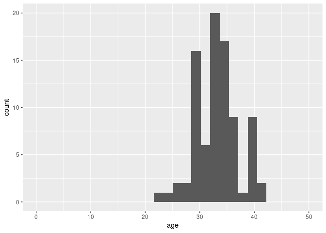

Project proposal
================
Postparty Experience - Willow, Tikyra, & Emmy

``` r
library(tidyverse)
library(broom)
library(readxl)
Postpartum_Experience_Survey_Responses_raw_data <- read_excel("../data/Postpartum Experience Survey (Responses) - raw data.xlsx")
#View(Postpartum_Experience_Survey_Responses_raw_data)
```

### 1. Introduction

The postpartum experience survey was created by Willow Gibson for a
research project assigned in an undergraduate course titled “History of
Midwifery and Women’s Healthcare in the US” at College of the Atlantic
in 2022. The survey was used to collect data about the postpartum
experiences of anyone who gave birth between 2013 and 2023. The purpose
of collecting this information was to observe the state of postpartum
care in the US with aim of learning what gaps in care exist.

Data was collected to through a Google form survey that was circulated
via email and briefly on social media. This dataset contains 788 cases
and 15 variables. One variable (`emails`) is not being included in our
analysis as it refers only to the email addresses of survey takers that
wished to learn more following analysis of the data.

We expect to add one or two additional variables to our dataset through
the process of mutating the types of postpartum care into quality
categories: good, better, and best. Definitions for these categories
will be determined as we work to analyze our data. While we recognize
that these definitions may be subjective in nature, we will be using
published references to help us quantify what types of support are most
fundamental to long term health vs what types of care are more optional.

For this project, we want to look more deeply at several of the
relationships between variables in this dataset. Some of the questions
we hope to explore are:

1.  Does quality of postpartum care vary from state to state?

2.  Is there a correlation between age and quality of postpartum care
    received/offered?

3.  If we categorize postpartum care into “good”, “better”, and “best”
    categories, what quality of postpartum care is the average birther
    receiving?

4.  What states require postpartum care to be covered by insurance? Does
    that requirement for coverage extend to Medicare recipients only, or
    does it extend to private insurance companies?

5.  What types of postpartum support did respondents say were most
    critical to their household within the first year following birth?
    Are these types of care typically covered by insurance or are
    families paying for these services out of pocket?

6.  Critical care vs ideal care - what are the differences?

### 2. Data

``` r
Postpartum_Experience_renamed_variables <- as_tibble(Postpartum_Experience_Survey_Responses_raw_data) %>% 
  rename( 
         `respondent` = `Timestamp`,
         `state` = `Which US state or country did you give birth in?`,
          `age` = `What was your age when you gave birth?`, 
      `birth_location` = `Where did you give birth?`,
        `informed_by` = `When you were pregnant, did your care provider give you information about postpartum care services?`,
    `other_info_sources` = `Did you learn about postpartum care services from any other sources?`, 
      `support_type`= `What types of support did you have access to postpartum?`,
         `provider` = `Who provided this support for you?`,
    `ins_covered_services` = `What postpartum care services did your insurance cover?`,
    `cost_factor` = `Was cost a factor in how much support you received?`,
        `if_insurance` = `If insurance covered postpartum care services, would you take advantage of it?`,
    `critical_support` = `What support was most critical to you/your household in first year following birth?`,
    `ideal_support` = `In a best case scenario, list all types of care and support you would need or want in the first year postpartum.`,
    `comments` = `Is there anything else you want to share about your postpartum experience?`,
    `emails` = `If you are open to follow up questions or want the results from this research project, please enter your email below.`)
```

``` r
Postpartum_renamed_variables_US <- Postpartum_Experience_renamed_variables %>%
  filter(state != "Uk") %>%
  filter(state != "Norway") %>%
  filter(state != "Puerto Rico")
```

``` r
dim(Postpartum_renamed_variables_US)
```

    ## [1] 784  15

Variables: 15

### 3. Data analysis plan

The variables we will be visualizing to explore the research questions
include (the numbers reference the questions listed in the
introduction):

1.  `state` and `quality`. The `quality` variable will be created
    through defining the good, better, and best categories of care.
2.  `age` and `quality`.
3.  `respondent` and `quality`.
4.  `ins_covered_services` plus data from additional source(s)
5.  `critical_support` , `timestamp` , `ins_covered_services` , and
    `cost_factor` We may also want to create a new variable called
    `out_of_pocket` to quantify what services were being paid for
    outside of insurance coverage.
6.  `critical_care` and `ideal_care`.

Other data needed:

- State by state postpartum insurance coverage requirements

- What factors are most important in postpartum care according to other
  sources (i.e. what services are equated with the best long term health
  outcomes)

- Distribution of quality of postpartum care across states

- Possible data source: Guarnizo, Tomás. “Doula Services in Medicaid:
  State Progress in 2022.” Center For Children and Families, Georgetown
  University Health Policy Institute, 2 June 2022,
  <https://ccf.georgetown.edu/2022/06/02/doula-services-in-medicaid-state-progress-in-2022>.

Types of graphs we may want to use:

- Histograms - to compare experiences depending on `birth_location`

- Bubble plot - to juxtapose `critical_support` and
  `ins_covered_services`

- Density plots - to compare how experiences vary with age

- Wordclouds - to visualize the repetitions within our qualitative data

- Maps - to compare results between US states

- Waffle plot - comparing `ideal_support` with `critical_support`

Preliminary exploratory data analysis:

``` r
Postpartum_renamed_variables_US |>
  count(informed_by) |>
  arrange(desc(n))
```

    ## # A tibble: 45 × 2
    ##    informed_by                                n
    ##    <chr>                                  <int>
    ##  1 No                                       448
    ##  2 Yes                                      292
    ##  3 Some information                           2
    ##  4 Apart from the follow up at 6 weeks no     1
    ##  5 As defined by?                             1
    ##  6 Baby 1/2 MDs-no, baby 3 midwife, yes       1
    ##  7 Breastfeeding groups                       1
    ##  8 CO- no. IA- yes.                           1
    ##  9 Don’t recall but I don’t think so          1
    ## 10 Don’t remember                             1
    ## # ℹ 35 more rows

Histogram Draft:

``` r
# Example data: Replace this with your actual data
tikyrabargraph <- Postpartum_renamed_variables_US

# Create the histogram
histogram <- ggplot(data = data.frame(value = tikyrabargraph), aes(x = value)) +
  geom_histogram(binwidth = 0.5, fill = "blue", color = "black", alpha = 0.7) +
  labs(title = "Histogram of Your Data",
       x = "Value",
       y = "Frequency") +
  theme_minimal()

#We probably need to figure out the good/better/best portions for the real one: x = state, y = quality of care ranking
```

Map Draft

``` r
#library(maps)
#library(mapproj)
#library(tidyverse)

#states <- map_data("state")
#states <- rename(states, state = region)
#statessurveyed <- `states`

#Postpartum_renamed_variables_US <- #Postpartum_renamed_variables_US %>% 
#  mutate(state = tolower(Postpartum_renamed_variables_US$state))
```

Visualization of filtered age distribution in California

``` r
library(stringr)
```

``` r
Postpartum_renamed_variables_US <- Postpartum_renamed_variables_US |>
  mutate(age = as.numeric(age))
```

    ## Warning: There was 1 warning in `mutate()`.
    ## ℹ In argument: `age = as.numeric(age)`.
    ## Caused by warning:
    ## ! NAs introduced by coercion

``` r
which(Postpartum_renamed_variables_US$age > 100)
```

    ## [1]  86 142 222

``` r
#`which` for identifying rows of a dataset.
```

``` r
Postpartum_renamed_variables_US %>%
  filter(state == "California") %>%
  ggplot(aes(x = age)) +
  geom_histogram() +
  xlim(0,50) #Additional outliers and NAs ignored for the sake of the visualization (still present in data frame)
```

    ## `stat_bin()` using `bins = 30`. Pick better value with `binwidth`.

    ## Warning: Removed 32 rows containing non-finite outside the scale range
    ## (`stat_bin()`).

    ## Warning: Removed 2 rows containing missing values or values outside the scale range
    ## (`geom_bar()`).

<!-- -->

String example

``` r
Postpartum_renamed_variables_US |>
  mutate(state = str_replace(state, "DC", "District of Columbia")) 
```

    ## # A tibble: 784 × 15
    ##    respondent          state   age birth_location informed_by other_info_sources
    ##    <dttm>              <chr> <dbl> <chr>          <chr>       <chr>             
    ##  1 2023-02-05 23:57:39 Cali…    30 At home        Yes         Birth education p…
    ##  2 2023-02-06 09:57:13 Penn…    26 Hospital, Was… No          Social media      
    ##  3 2023-02-06 11:54:12 Mich…    21 At home        No          Social media      
    ##  4 2023-02-06 21:04:15 Mass…    NA Hospital       Yes         Birth education p…
    ##  5 2023-02-06 21:19:43 Dist…    36 Hospital       No          Birth education p…
    ##  6 2023-02-06 21:20:00 Mary…    NA Hospital       Yes         Family members or…
    ##  7 2023-02-06 21:20:05 Sout…    NA Hospital       No          Birth education p…
    ##  8 2023-02-06 21:27:11 Maine    28 At home        No          Books             
    ##  9 2023-02-06 21:34:54 Arka…    42 Hospital       Yes         Family members or…
    ## 10 2023-02-06 21:41:49 Mass…    33 Hospital       No          Family members or…
    ## # ℹ 774 more rows
    ## # ℹ 9 more variables: support_type <chr>, provider <chr>,
    ## #   ins_covered_services <chr>, cost_factor <chr>, if_insurance <chr>,
    ## #   critical_support <chr>, ideal_support <chr>, comments <chr>, emails <chr>

``` r
#In order to correct specific mistakes/misspellings etc across the data frame.
```

## 4. Data Ethics Review

The data ethics review section will be introduced in a separate class
and is not part of the original proposal deadline.
